### What are tress used for?

Store data that are naturally organized in a hierarchical structure

- File systems
- Databases
- Router systems
- DOM

### Types of Trees

1. Binary Tree
   1. Up to 2 children
   2. Example - Binary Search Tree, Binary Heaps
2. Ternany Trees
   1. Up to 3 children
3. K-nary Trees
   1. Up to k children
4. Tries (digital/prefix trees)
   1. Allows search by prefixes
5. Balanced Search Trees
   1. B-trees
   2. AVL trees
   3. Red-black Trees

### Terminology

1. Root - start of the tree structure
2. Each parent can have multiple children
3. 2 children with same parent are called siblings
4. Concept of depth - at Root = 0
5. Relationship between 1 parent to a child is called an edge.
   1. degree of parent = number of edges

### Binary Tree Attributes

- Nodes
  - Value
  - Children
    - left child
    - right child

### Binary Tree Properties

If a binary tree has N nodes, how many edges does it have?
E = N - 1

If a full and complete tree has D levels, how many nodes does it have?
N = 2^D - 1 ~ 2^D
N ~ 2^D
D = log N

Proof
nodes = 2^0 + 2^1 + 2^2 + 2^3 + 2^4 + ... + 2^D-1 = 2^D - 1
If we look at the equation above

- N usually refers to Time Complexity or Runtimes
- D refers to the height which is the basis of Space Complexity

### Array Representation of a Tree

if a Node is at index - `i`
it's left child will be at - `2 * i + 1`
it's right child will be at - `2 * i + 2`
it's parent will be `[i / 2]`

### Tree Traversals

1. Breadth First Search (BFS)
   1. Use Queue
   2. Done iteratively
2. Depth First Search (DFS)
   1. Use call stack
   2. Done recursively
   3. Preorder (Node, Left, Right)
   4. Inorder (Left, Node, Right)
   5. Postorder (Left, Right, Node)

### DFS types

1. Bottom-up DFS
   1. Cumulative bottom-up
   2. Extra variable(s) bottom-up
2. Top-down DFS
   1. Cumulative top-down
   2. Search Root-to-leaf Paths
3. DFS Tree Arrays
   1. By Stack
   2. By Recursion

### DFS Recursion
1. Most of the DFS tree problems are solved using recursion
2. The following process takes place on every subtree during the recursion
   1. For the problem f(root)
   2. Break it down into subproblems f(root.leftSubtree) and f(root.rightSubtree)
   3. Recursively solve the subproblems
   4. Combine the results of the subproblems to solve the major problem f(root)


### DFS Recursive solution has 2 parts

1. Learn the base case usually at the bottom of the tree.
2. Learn the general case (repeat on all subtrees)
   1. Recursion calls on root.left and root.right
   2. Handle root node.

### Bottom-up DFS

Scenario - The answer of the current tree is based of the subtrees
Solution - Find out how the root node builds on top of the result from the subtrees
Time Complexity - O(N)

### Template for bottom-up DFS

```python
def dfs(root):
    # base case(s)
    if not root: # leaf node may also be a base case i.e node.left and node.right are None
        return ?
    
    # general cases
    left = dfs(root.left)
    right = dfs(root.right)
    result = ? # handle and combine root and left and right
    return result # all the return statements answer the same question
```

### Tree Size

Get the number of nodes in a tree


```python
def dfs(root): # return count of nodes in the tree
    # base case
   if not root: # answer for the empty tree
      return 0
   
   # general case
   left = dfs(root.left)
   right = dfs(root.right)

   # handle and combine root and left and right
   result = 1 + left + right # key - handle current node properly so that the same pattern will recur on all the nodes.
   return result
```

Similarly, get the maximum path sum (from root to leaf)

```python
def dfs(root): # return maximum path sum
    # base case
   if not root: # answer for the empty tree
      return 0
   
   # general case
   left = dfs(root.left)
   right = dfs(root.right)

   # handle and combine root and left and right
   result = root.val + max(left, right) # key - handle current node properly so that the same pattern will recur on all the nodes.
   return result
```

Get the sum of values of a binary tree

```python
def dfs(root): # return sum of values
    # base case
   if not root: # answer for the empty tree
      return 0
   
   # general case
   left = dfs(root.left)
   right = dfs(root.right)

   # handle and combine root and left and right
   result = root.val + left + right # key - handle current node properly so that the same pattern will recur on all the nodes.
   return result
```

Get the depth of a binary tree
        
```python
def dfs(root): # return count of nodes in the tree
    # base case
   if not root: # answer for the empty tree
      return 0
   
   # general case
   left = dfs(root.left)
   right = dfs(root.right)

   # handle and combine root and left and right
   result = 1 + max(left, right) # key - handle current node properly so that the same pattern will recur on all the nodes.
   return result
```

### Clone Tree

How to clone a binary tree?

```python
class TreeNode:
   def __init__(self, val):
      self.val = val
      self.left = None
      self.right = None 

def cloneTreeDFS(root): # return a deep copy of the given tree
   if not root:
      return None
   
   copy = TreeNode(root.val)
   copy.left = cloneTreeDFS(root.left)
   copy.right = cloneTreeDFS(root.right)
   return copy
```

### Search Tree Node

Find if node n is in the tree

```python
def search(root, n):
   if not root:
      return False
   
   left = search(root.left, n)
   right = search(root.right, n)

   return root.val == n or dfs(root.left) or dfs(root.right)
```

Find either if node n or node m is in the tree

```python
def search(root, n, m):
   if not root:
      return False

   if root.val == n or root.val == m:
      return True
   
   left = search(root.left, n, m)
   right = search(root.right, n, m)

   return left or right
```

Find if node n or node m is in the tree

```python
def search(root, n, m):
   if not root:
      return False

   if root.val == n or root.val == m:
      return True
   
   # (bool isMThere, bool isNThere) i.e (bool isMThere, position, infinity)
   # found 1 node return 1, 
   # found both return 2
   left = search(root.left, n, m)
   right = search(root.right, n, m)

   return left and right   
```

### Symmetric Tree

Find whether a binary tree is symmetric (find if 2 trees are mirror images of each other)

```diagram
        1
       / \
      2   2
     / \  / \
    3   4 4  3
       /     \
      5       5
```

```python
# Post order DFS
def symmetric(root):
   def isSymmetric(node1, node2):
      if not node1 and not node2:
         return True
      if not node1 or not node2:
         return False
      
      left = isSymmetric(node1.left, node2.right)
      right = isSymmetric(node1.right, node2.left)
      
      return node1.val == node2.val and left and right

   return isSymmetric(root, root)

# Kinda Pre order DFS
def symmetric(root):
   def isSymmetric(node1, node2):
      if not node1 and not node2:
         return True
      if not node1 or not node2 or node1.val != node2.val:
         return False
      
      left = isSymmetric(node1.left, node2.right)
      right = isSymmetric(node1.right, node2.left)
      
      return left and right

   return isSymmetric(root, root)
```

### Extra-variable Bottom-up DFS

Scenario - The answer for the current tree is indirectly based on the results of its subtrees
Solution - Make an extra variable keep alongside of the recursion
Complexity - O(N)

What is a balanced binary tree?
A binary tree in which the left and right subtrees of every node differ in height by no more than 1.
`-1 <= depthLeft - depthRight <= 1 on all subtrees`

### Validate Balance Binary Tree

Find if the tree is balanced? `-1 <= depthleft - depthright <= 1 on all subtrees`

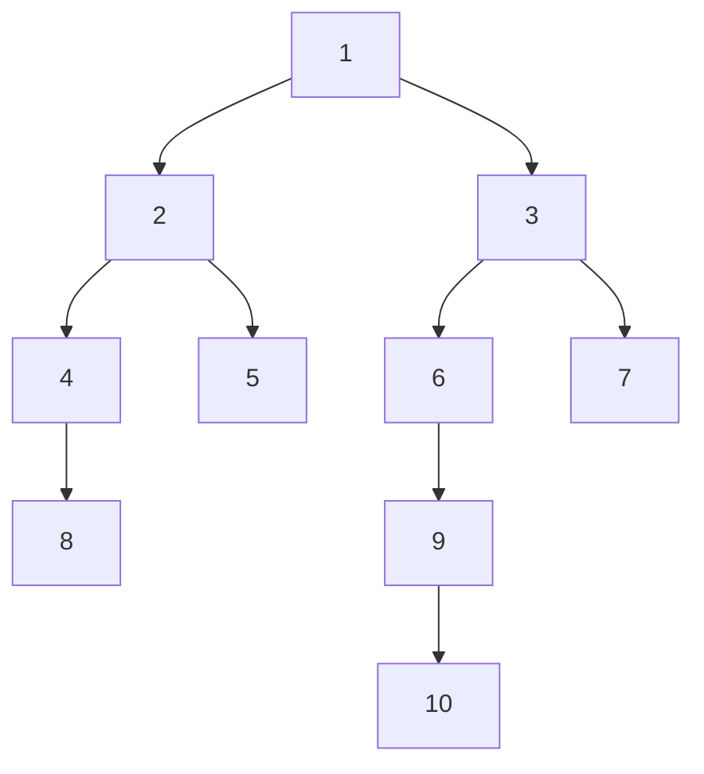

```python
def validate(root):
   # Initialize the global variable for answer
   isBalanced = True

   def dfs(root):
      if not root:
         return True
      
      left = dfs(root.left)
      right = dfs(root.right)

      # Udpate the global variable
      if abs(left - right) > 1:
         isBalanced = False

      return 1 + max(left, right)
   
   dfs(root)
   return isBalanced

# without global variable
"""
The expected output is a boolean value
But since depth is needed for the balanced check,
consolidate boolean and depth (a positive integer) into "int" as return type

Return an int
int == -1 => Unbalanced denotes
int > 0 => depth of the subtree
"""
def validate(root):
   def dfs(root): # return an int, int == -1 => denotes Unbalanced, int > 0 => depth of the subtree
      if not root:
         return 0
      
      depthLeft = dfs(root.left)
      depthRight = dfs(root.right)

      # subtree is unbalanced, therefore tree is unbalanced
      if depthLeft == -1 or depthRight == -1:
         return -1

      # Left depth and right depth difference is more than 1, therefore tree is unbalanced
      if abs(depthLeft - depthRight) > 1:
         return -1

      # tree is balanced, return depth of the subtree
      return 1 + max(depthLeft, depthRight)
   
   return dfs(root) != -1

```

### Maximum Average Subtree

`let the dfs function return sum of values and tree size`

```python

def getMaxAvgTree(root: TreeNode) -> int:
   max_avg_tree = None
   max_avg = float("-inf") # global variable

   def dfs(node):
      if not node:
         return 0, 0
      
      values_left, size_left = dfs(node.left)
      values_right, size_right = dfs(node.right)

      values = values_left + node.val + values_right
      size = size_left + size_right + 1
      avg = values / size

      if (node.left or node.right) and max_avg < avg: # ignore leaf nodes
         max_avg = avg
         max_avg_tree = node
      
      return values, size
```


What is a full binary tree?
A tree in which every node other than the leaves have 2 children.
or binary tree with the maximum number of nodes is a full binary tree.
If the height of a binary tree is H, then the height of a full binary tree is 2^h+1 - 1 maximum number of nodes

What is a complete binary tree?
A complete binary tree is a binary tree in which every level, except possibly the last, is completely filled, and all nodes are as far left as possible
The height of a complete binary tree is always minimum i.e O(log N)

### Diameter of a tree

Find diameter:  Length of the longest path from leaf to leaf

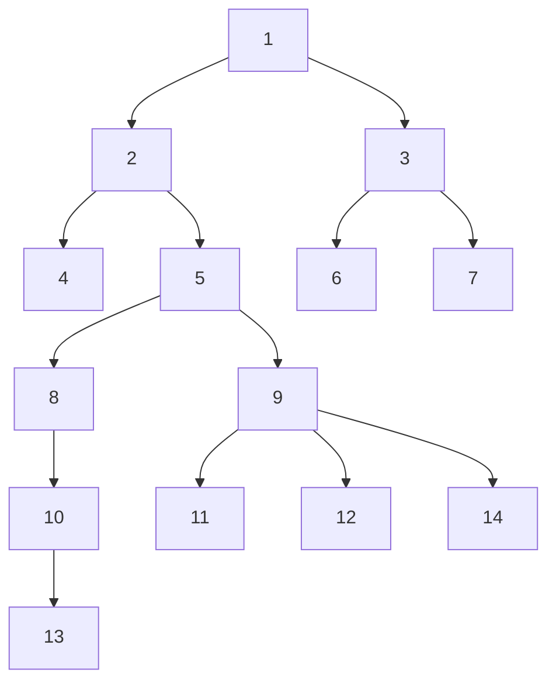

Extra variable: Depth
Result: balanced
1. Bottom up
2. Extra variable: length of the path from leaf to leaf

If you check any node -> you will see that the diameter that passes through the given node,
will be depth of the left child and the depth of the right child plus the given node = total

```python
def diameter(root):
   diameter = 0 # set diameter as a global variable

   def dfs(root): # let dfs() return the depth of the tree
      if not root:
         return 0
      
      depthLeft = dfs(root.left)
      depthRight = dfs(root.right)

      diameter = max(diameter, 1 + depthLeft + depthRight) # update global variable
      return 1 + max(depthLeft, depthRight)

   dfs(root)
   return diameter

# Can you do it without using a global variable?
# let dfs() return both depth of the tree and diameter of the tree
def diameter(root):
   def dfs(root):
      if not root:
         return (0, 0) # make sure all the return values are tuples, and consistently return both the variables
      
      diameterLeft, depthLeft = dfs(root.left)
      diameterRight, depthRight = dfs(root.right)

      diameter = max([diameterLeft, diameterRight, 1 + depthLeft + depthRight])
      return (diameter, 1 + max(depthLeft, depthRight))

   return dfs(root)

```

#### Max Difference

Find the maximum difference between an ancestor node and any of its descendant node, where (ancestor.value - descendant.value) is the maximum

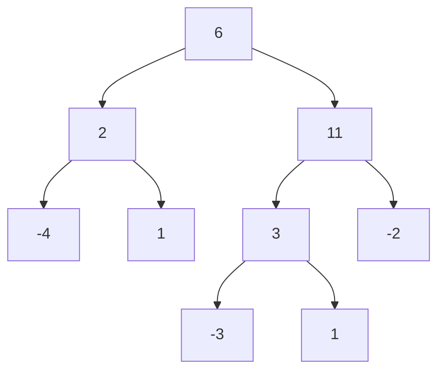

```bash
Output: 11 - (-3) = 14
```

| The idea is to get the min/max descendant value of the subtree for any given node.

```bash
Fill template
result = max(
   max(abs(node.val - min(left_min, right_min)))
   ,
   max(abs(node.val - min(left_max, right_max)))
)
```

```python
def maxDifference(TreeNode root):
   def dfs(node, min_val, max_val): # pre order
      pass

   def dfs(node, min_val): # post order
      if not node:
         return float("inf"), 0

      if not node.left and not node.right:
         return node.val, 0
      
      left_min, left_result = dfs(node.left, min_val)
      right_min, right_result = dfs(node.right, min_val)

      max_diff = max([node.val - left_min, node.val - right_min, left_result, right_result])

      return min([node.val, left_min, right_min]), max_diff
   
   _, result = dfs(root, float("inf"))
   return result
```

#### Lowest Common Ancestor

Find the lowest common ancestor given 2 nodes in a tree.

- `LCA()` searches for node a and node b in a tree.
- Return `None` indicated `Not Found`.
- If either a or b is found in the tree, return the found node.
- If lowest common ancestor is found, return ancestor.

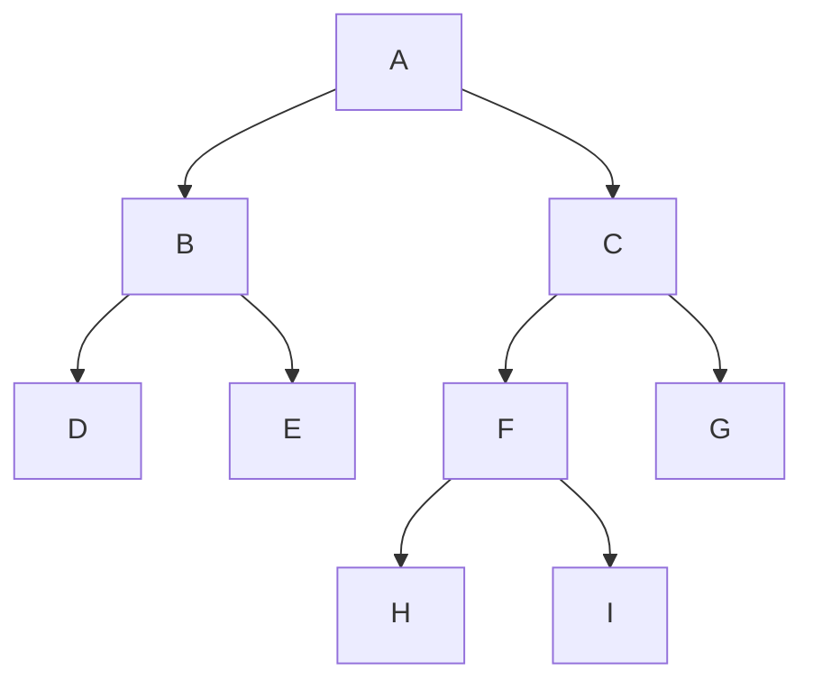

```bash
Input: Node I and G
Output: Node C
```

Lets check what is required?

1. DFS or BFS? - DFS
2. Preorder or Postorder? -> Postorder (information accumulated from below)
3. Extra variable required? -> A node (if target is found?)
4. Possible merge extra variable with result variable? 
   -> Yes, coz one variable is boolean: bool -> Node
   -> Denoting False with a node
   -> Denoting False with a -1
   -> Denoting both nodes with 2
   -> Denoting Node with 0

```python
def lca(root: TreeNode, a: TreeNode, b: TreeNode) -> bool:
   def dfs(node, a, b):
      if not node:
         return node
      
      if node in {a, b}:
         return node

      left = dfs(node.left)
      right = dfs(node.right)

      # a and b are on the different sides of the root.
      # Therefore current node / root is the common ancestor
      if left and right:
         return node
      # a, b are on the left, common ancestor is what the left subtree returns
      if left:
         return left
      # a, b are on the right
      if right:
         return right
      
      # otherwise neither a nor b is in the tree
      # return left or right

   return dfs(root, a, b) 
```

#### Binary Tree to DLL

Convert binary tree to doubly linked list in-order sequence.

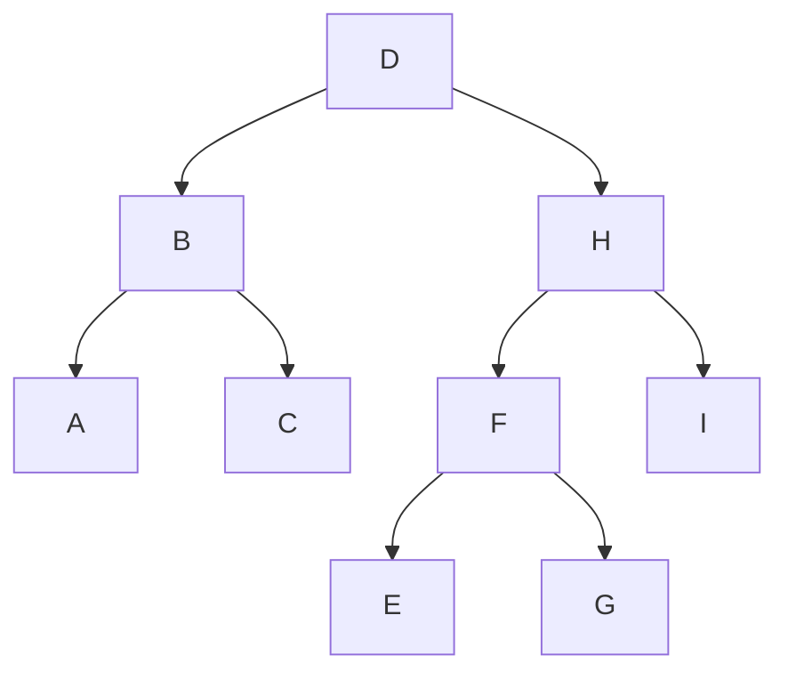

```python
class Node:
   def __init__(self, val, left=None, right=None):
      self.val = val
      self.left = left
      self.right = right

# @return head, tail nodes of a DLL
def BSTtoDLL(root: Node) -> Node, Node:
   def dfs(node):
      if not node:
         return None, None

      head, tail = node, node

      head_left, tail_left = dfs(node.left)
      head_right, tail_right = dfs(node.right)

      if head_left: # left isn't empty
         tail_left.right = node # append root to left list
         node.left = tail_left
         head = head_left
      
      if head_right: # right isn't empty
         head_right.left = node # append root to right list
         node.right = head_right
         tail = tail_right
      
      return head, tail
   
   return dfs(root)

# if asked to return head
"""
if not root:
   return None

head, tail = dfs(root)
tail.right = head
head.left = tail
return head
"""

# Note
"""
you can do this using Inorder iterator in the non-recursive way so that you pop the nodes in the inorder sequence and then you just have to link the popped nodes together into a linked list instead of pushing them into your list
"""
```

</br>

##### Output

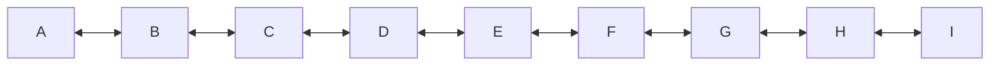

#### Longest Increasing Path

Find out the longest increasing path from top to bottom in the given tree. (Hint: Search for the longest decreasing path from bottom to top)

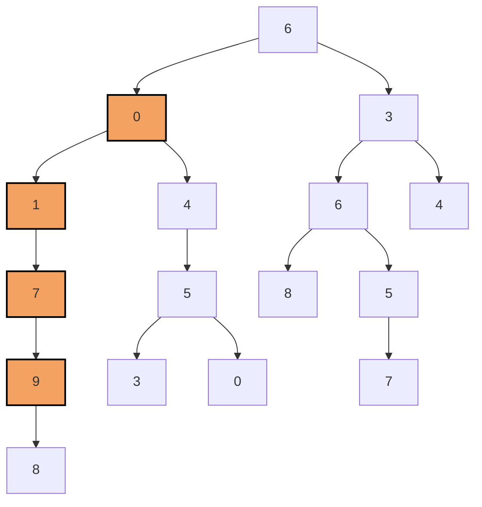

```python
# dfs() return length of the increasing path to root in the current subtree
def increasingPath(root: TreeNode):
   longest_increasing_path = 0

   def dfs(node):
      if not node:
         return 0

      nonlocal longest_increasing_path

      left = dfs(node.left)
      right = dfs(node.right)

      left_increasing_path = 1 + left if node.left and node.left.val > node.val else 1
      right_increasing_path = 1 + right if node.right and node.right.val > node.val else 1

      length = max(left_increasing_path, right_increasing_path)
      longest_increasing_path = max(longest_increasing_path, length)

      return length
   
   dfs(root)
   return longest_increasing_path
```

```bash
Expected Output: 4
path: [0, 1, 7, 9] is the longest path
```

```python

```

## Top Down DFS

Scenario: The answer of the current tree is based on the parent.\
Solution: Find out the current node builds up on top of its parent.\
Complexity: O(n)\

### Top Down vs Bottom Up

Count levels of a binary tree

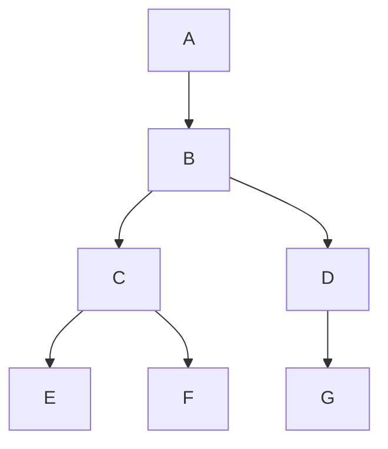

```python
def height(root): # bottom-up dfs
   if not node:
      return -1
   left = height(root.left)
   right = height(root.right)
   return 1 + max(left, right) 
   # bottom up handles root node at the return statment
```

```python
def depth(root, d): # top-down dfs
   if not node:
      return d - 1
   left = depth(root.left, d + 1)
   right = depth(root.right, d + 1)
   return 1 + max(left, right)
   # top down handles root by input parameters
```

|          | Top-down DFS | Bottom-up DFS |
|---------------|-------------|--------------|
| **Definition** | The answer on the current node is built from the answer on its **parent** | The answer on the current node is built from the answer on its **children** |
| **Traversal Direction** | Visits all paths from **root to leaf** | Visits all subtrees from **bottom to top** |
| **Handling Nodes** | Handles the current node while **pushing** into the log stack (by input parameter) | Handles the current node while **popping** from the log stack (by return statement) |

### Validate Binary Search Tree

BST keep the keys in sorted order i.e `left <= mid < right`

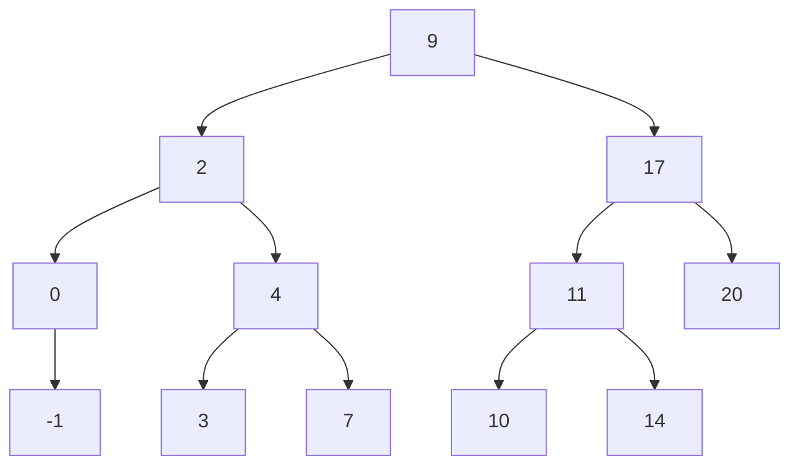

```python
def isBST(root: TreeNode) -> bool:
   def dfs(node, floor, ceiling):
      if not node:
         return True
      
      if floor <= node.val < ceiling and dfs(node.left, floor, node.val) and dfs(node.right, node.val, ceiling):
         return True

      return False

   return dfs(root, float("-inf"), float("inf"))

### Width Of A Binary Tree

Find out the maximum width of a binary tree

```python
def max_width(root: TreeNode) -> int:
   leftbound, rightbound = 0, 0
   
   def dfs(node, column):
      if not node:
         return

      nonlocal leftbound
      nonlocal rightbound

      dfs(node.left, column - 1)
      dfs(node.right, column + 1)

      # update leftbound and rightbound
      leftbound = min(leftbound, column)
      rightbound = max(rightbound, column)

   dfs(root, 0)
   return rightbound - leftbound + 1
```

### Range Sum BST

### Find the sum of nodes within the range (lo, hi)

`Preorder - cummulative sum`

```python
def rangeSumBST(root: TreeNode, lo: int, hi: int) -> int:
   result = 0

   def dfs(node):
      if not node:
         return

      nonlocal result

      if lo < node.val:
         dfs(node.left)
      if node.val < hi:
         dfs(node.right)
      
      if lo <= node.val <= hi:
         result += node.val

      dfs(root)
      return result
```

### DFS Preorder traversal

Usually used for problems like Root -> leaf, width of a tree, etc.
The extra variable is passed as an input parameter

### Search Paths

Scenario: Visit and search every root to leaf path in a tree.\
Solution: Keep track of log stack with an extra stack as an input parameter.\
Complexity - O(N)

### Print all paths in tree,

`where no access to root.val
only access to root.left.val and root.right.val`

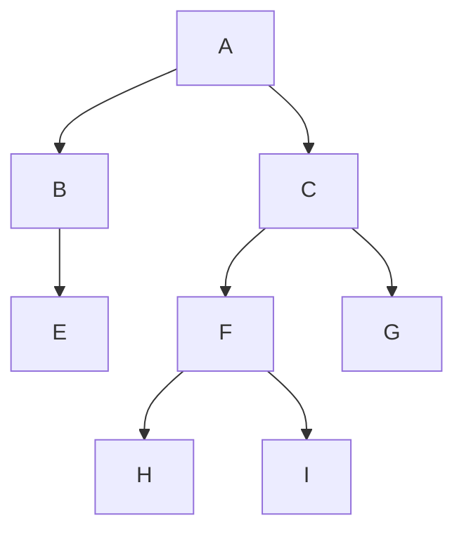

```python
def printPaths(root: TreeNode) -> None:
   def dfsPath(node):
      if not node:
         return

      # preorder add node
      path.append(node.val)
      if not node.left and not node.right: # leaf node
         print(path)
      
      dfs(node.left, path)
      dfs(node.right, path)

      # post order pop node
      path.pop() # backtracking (withdraws the action took by preorder)

   path = [] # follows the log stack
   dfsPath(root)
```

### Find the Pseudo Palindromic Path

```mermaid
```

Note:

This is similar to maze searching problem for graphs

- From a source node you check how many path can enter the destination node
- if you enter the destination node return one if you enter a blocked node or enter
- an invalid node return zero and then you add up the results of the four calls

```python

```

### Return the count of leaf nodes containing letter "n" in it

This is exactly same as maze search problem

### Find the Inorder Successor of a Target node in a BST

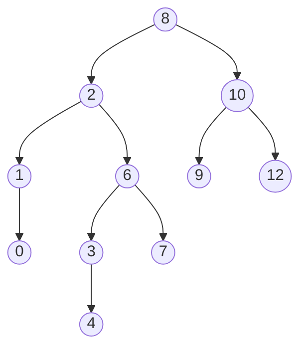

```python
def inorderSuccessor(root: TreeNode, p: TreeNode) -> Optional[TreeNode]:
   def dfs(node):
      nonlocal found_p, result
      if not node or result:
            return

      dfs(node.left)

      # If we've already seen p, the current node is the successor
      if found_p and result is None:
            result = node
            return

      # Check if this node is p
      if node == p:
            found_p = True

      dfs(node.right)

   found_p = False
   result = None
   dfs(root)
   return result
```

### Build Inorder Iterator of a Binary Tree

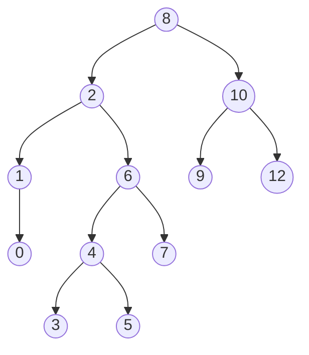

```python
class InorderIterator:
   def __init__(self, root: TreeNode) -> None:
      self.stack = []
      self._move_left(root)

   def has_next(self) -> bool:
      return len(self.stack) > 0

   def next(self) -> TreeNode:
      if not self.has_next():
         raise Exception("End of iterator")
      
      curr = self.stack.pop()
      self._move_left(curr.right)

      return curr
   
   def _move_left(self, node: TreeNode) -> None:
      while node:
         self.stack.append(node)
         node = node.left
```

#### Inorder

```python
def inorder(root: TreeNode):
   stack = []
   node = root

   while stack:
      if node: # move left
         stack.append(node)
         node = node.left
      else: # left empty pop self and move right
         curr = node.pop()
         print(node.val, end="")
         node = node.right
```

Apply DFS non-recursively using a Stack

### Preorder Iterator of a Binary Tree


```bash
stack = [12, 9, 4]
```

```python
def preorder(root):
   stack = [root]

   while stack:
      # Pop left to right
      node = stack.pop()
      print(f"{node.val}, {" "}")
      # Push right to left
      if node.right:
         stack.append(node.right)
      if node.left:
         stack.append(node.left)
```

### DFS Tree Array

Given the preorder sequence of a BST, find the in-order sequence of the tree.

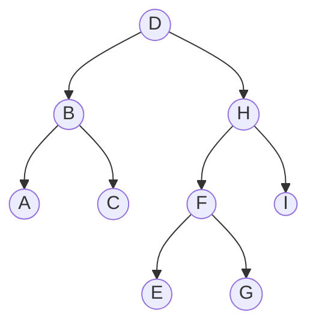

```python
def getInorder(preorder):
   stack, i = [], 0

   while i < len(preorder):
      if not stack or preorder[i] < stack[-1]:
         stack.append(preorder[i])
         i += 1
      else:
         print(stack.pop())
      
   while stack:
      print(stack.pop())
```

### Backtracking

Withdraws anything that you did before

```python

def printPaths(root):
   def dfs(path):
      if not root:
         return

      if not root.left and not root.right:
         print(path)
      else:
         path.append(root.left.val)
         dfs(path)
         path.pop()
         
         path.append(root.right.val)
         dfs(path)
         path.pop()

   dfs([])
   return
```

### kth Ancestor
 
 Find the ancestor node that is k levels above the target node in a binary tree.

- Every node's value is unique and positive.
- `k` and target are positive integers. 
- You are given the root node of the tree.

```bash
Input1: target = 5, k = 2
Output: 8

Input2: target = 6, k = 2
Output: 4
    
Input3: target = 7, k = 3
Output: 4
    
Input4: target = 2, k = 2
Output: -1 (no ancestor is k levels above target)
```

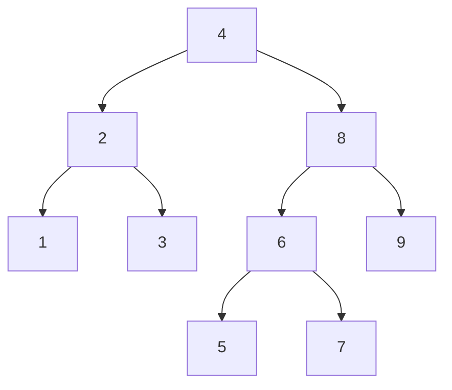

```python
def k_ancestors(root: Node, target: int, k: int) -> int:
    kth_ancestor = -1

    def dfs(node):
        if not node:
            return -1
        
        if node.val == target:
            return 1  # Start depth count

        nonlocal kth_ancestor

        left_depth = dfs(node.left)
        right_depth = dfs(node.right)

        # Select the valid depth (whichever is non-negative)
        depth = max(left_depth, right_depth)

        if depth != -1:  # Valid depth found
            if k == depth:
                kth_ancestor = node.val
            return depth + 1  # Increment depth

        return -1

    dfs(root)
    return kth_ancestor
```

### Postorder Iterator


```python
class TreeNode:
   def __init__(self, val=0, left=None, right=None):
      self.val = val
      self.left = left
      self.right = right

class PostorderIterator:
   def __init__(self, root):
      self._stack = []
      self._lastPop = None
      self._move_deep_left(root)

   def has_next(self):
      return len(self._stack) > 0

   def next(self):
      if not self.has_next():
         raise Exception("End of iterator")

      self._lastPop = self._stack.pop()
      node = self._lastPop

      # If the popped node has a right child, process its right subtree
      if self._stack and self._stack[-1].right == node:
         self._move_deep_left(self._stack.pop().right)

      return node.val  # Return the value of the visited node

   def _move_deep_left(self, node):
      """
      Push nodes to stack ensuring postorder order: Left -> Right -> Root
      """
      while node:
         self._stack.append(node)
         # If a node has a right child, push it after the left child
         if node.right:
               self._stack.append(node.right)
         node = node.left

```

Note:
Postorder DFS - finds LCA
Preorder DFS - finds the deepest leaves
All the cumulative max sum is postorder

If everything looks up to the root node as a baseline then its a preorder


### N-ary Tree

Scenario - A tree can have an arbitrary number of children.\
Solution - Find out how the root node builds on top of the result from the subtrees.

```python
# Each tree node can have arbitrary  number of children
class TreeNode:
   def __init__(self, val):
      self.val = val
      self.children = [] # list of children
```

#### Template for DFS n-ary tree tree

```python
def dfs(root):
   # Base Case
   if not root or not node.children: # None or leaf
      return ?

   # General Case
   for child in root.children: # Call dfs on all child node
      r = dfs(child)

   result = ? # handle root and results of recursions
   
   return result
```

Deserializing a tree is nothing but clone of a binary tree.

#### BFS template

We can implement BFS using a queue. Important things to remember:

1. We need at least one element to kick start the process
2. Right after we dequeue an element, we'd want to enqueue its children if there are any
3. from collections import "deque"

```python
from collections import deque

def bfs_by_queue(root):
    queue = deque([root]) # at least one element in the queue to kick start bfs
    while queue: # as long as there is an element in the queue 
        node = queue.popleft() # dequeue
        for child in node.children: # enqueue children
            if OK(child): # early return if problem condition met
                return FOUND(child)
            queue.append(child)
    return NOT_FOUND
```

### Trie

A Trie is a prefix-tree, (as elements can be stored in prefixes) which stores strings in it - is an ordered data structure that is used to store a dynamic set of strings

```python
strs = ["cab", "cat", "can" "cat", "a", "an", "ann", "ant", "carb", "crab", "ban", "bat", "ran"]
"""
            ""
      /    /  \   \
      c     a    b   r
      / \    |    |   |       
      a   r   n    a   a
   / | \ \   /\    /\  |
   b  t  n r  n t  n  t n 

   Time Complexity - 26 ^ D
"""

class TrieNode:
   def __init__(self, end_of_word=False, size=26):
      self.end_of_word = end_of_word
      self.children = children if children is not None else [0] * size


# if character is not sequentially ordered, usually when trying to store around 256 characters
class TrieNode:
   def __init__(self, end_of_word=False, size=0):
      self.end_of_word = end_of_word
      self.children = children if children is not None else {}
```

### Build a tree from an array

Scenario - Recover the tree based on it's DFS traversal sequence.
Solution - Look for the subsequence of left and right subtree to recurse on.
Complexity - O(NlogN)

### BFS template

```
 while (!Q.empty())
 {
     size = Q.size()
     for i in range 0..size
     {
         node = Q.pop()
         Q.push(node.left)
         Q.push(node.right)
     }
 }
 ```

BFS - Highest Common descendant
Double BFS

### Helper Method Template

1. Instantiate scope variables
2. Return result
3. a) Create helper method
   b) Invoke helper method
4. Base case
5. Recursive case

### Permutations and Combinations problems

The problem of permutations/combinations summing up to a certain amount can turn into a tree.
The root node contains the entire problem for amount A.

#### Permutation Tree

At every level we can try and make the tree relatively easier to understand
All the K choices available at a root node lead to K child nodes of root.
Each child node contains a subproblem.

The key to solving these problems is to determine if the tree covers all possible choices we can make about coin selection and it's outcomes.

Do we have each face value once or infinite times?

Implement all paths in a permutation tree

To figure out the time and space complexity of permutation and combination sum problems, we will have to find out

1. What n-ary tree it is?
2. Height of the tree.

Example - k-nary tree, Height H = k^H

```python
# All Permutation Paths Template
def print_permutation_tree(amount: int, coins: List[int]):
   def backtrack(amount, path):
      # base cases
      if amount < 0: # the end of an invalid path
         return
      if amount == 0: # the end of a valid path
         print(path)
         return
      # general cases
      for coin in coins: # visit child nodes
         path.append(coin)
         backtrack(amount - coin, path)
         path.pop()
   
   backtrack(amount, [])
```

In coin change problem what determines the height of the tree

- We have figure out whether the input parameters amount or coins.length is the height of the tree.
- Say for worst case the least coin is 1 cent in that case, we will decrement -1 at each level until we hit Amount = 0. Therefor H = amount

`H = A / least(coins)`
`k = coins.length` i.e the number of selections you can make in a tree

Total Complexity = coins.length ^ (amount / min(coins))

Usually such problems are time consuming because they grown exponentially.
Even using DP the space would grown exponentially. Therefore there is no way around it.

### Combination Tree

The key is to not reuse a coin that has been discarded (the coin already used)

Example in coin change problem, we can keep coins in the increasing amount of coins - [5, 5, 10]

A = 20, i = 0, p = []

Everything from 0 -> i discarded, i -> end available

So is it still a 3-nary tree? what choice are available for root?
For combinations ignore the discarded nodes when making the choices.
Make a placeholder index `i` for coins array.
Coins before index i are discarded and ignored.

And this kind of approach is very common in DP problems. It's called 1/0 tree (yes/no tree)
Example, when we have such a problem

```
A = 20, i = 0, p = []
at i = 0, we have 2 choice where take the coin or don't take the coin
               A = 20, i = 0, p = []     coins = [5, 10, 20]
   select coins[i] /  \ discard coins[i]          0   1   2
   A = 15, ?, p = [5]     A = 20, i = 1, p = []
```

Time Complexity - 2 ^ (Amount vs max(coins.length))
DP would be optimal for 0/1 trees
less efficient for K-nary trees
Why? because when we filling the DP array from bottom to top, every node depends of 2 child nodes, hence we visit the previous 2 indices in the array and get the values, whereas for K-nary trees we have to go back k times to the indices

But if it's recursive solution, k-nary tree is preferred as we don't travel the discarded portion

1/0 tree every DP block takes 2 former block to build the solution, whereas k-nary tree takes k changes

K-nary tree is sub optimal for DP, whereas relatively optimal for recursive solution.

Combination tree can be optimal by using K-nary tree and not 0/1 tree

```
Example
A = 20, i = 0, p = [] 
we have 0 -> end available to make choices,
hence at level 1 we will have A = 15, i = 0, p = [5], A = 10, i = 1, p = [10], A = 0, i = 2, p = [20]
level 2 A = 10, i = 0, p = [5, 5], A = 5, i = 1, p = [5, 10], ..
```

The tree is more skewed towards the left and time complexity on average case is still 2 ^ (Amount)

```python
"""
Input - A = 20, coins = [5, 10, 20]
Output - 
Combinations
[
   [5, 5, 5, 5],
   [5, 5, 10],
   [10, 10],
   [20]
]
"""

# All Combination Paths Template k-nary tree version
def print_combination_tree(amount: int, coins: List[int]):
   def backtrack(amount, i, path):
      # base cases
      if amount < 0: # the end of an invalid path
         return
      if amount == 0: # the end of a valid path
         print(path)
         return
      # general cases
      for j in range(i, len(coins): # visit child nodes
         path.append(coin[j])
         backtrack(amount - coins[j], j, path)
         path.pop()
   
   backtrack(amount, 0, [])


# All Combination Paths Template 1/0 tree version (binary tree)
def print_combination_tree(amount: int, coins: List[int]):
   def backtrack(amount, i, path):
      # base cases
      if amount == 0: # the end of a valid path
         print(path)
         return
      if amount < 0 or i >= len(coins): # the end of an invalid path
         return
      # general cases
      # 1st child is YES, left hand side
      path.append(coins[i])
      backtrack(amount - coins[i], i, path)
      path.pop()

      # 2nd child is NO 
      backtrack(amount, i + 1, path)
   
   backtrack(amount, 0, [])
```

### Coin Change

Given N kinds of coin values [c0, c1, c2, ...], find out all the coin permutations and combinations summing up to the amount \(A\). You may assume that every value has an infinite number of coins available.

Input
A = 20
coins = [5, 10, 20]

Output
Combinations
[5, 5, 5, 5]
[5, 5, 10]
[10, 10]
[20]

Permutations
[5, 5, 5, 5]
[5, 5, 10]
[5, 10, 5]
[10, 5, 5]
[10, 10]
[20]

# Understanding the Coin-Change Problem: Six Variants of Combinations & Permutations

## Overview

Coin-change and combinatorial problems may look similar at first glance, but subtle differences in constraints require entirely different approaches. In our discussion, we identified **six variants** of the coin-change problem based on two main axes:

1. **Output Type:**  
   - **Combinations:** Order does not matter.  
   - **Permutations:** Order matters.

2. **Coin Availability:**  
   - **Infinite copies of each coin.**  
   - **Exactly one copy of each coin.**  
   - **Input with duplicates** (e.g., the input lists coins such as `[5, 5, 10, 10, 20]`).

This document explains these variants in detail, provides diagrams and decision trees, and includes example implementations for each variant.

---

## 1. The Basic Problem Statement

**Problem:**  
Given a set of coin denominations (for example, `[5, 10, 20]`) and a target amount \(A\) (for example, \(20\)), determine all the ways to reach \(A\) using the available coins.

Depending on how the coins are provided and how the solution is defined, the variants are as follows:

- **Combinations:** The order of coins does not matter.  
- **Permutations:** The order of coins matters.

**Example (Infinite Copies):**

- **Combinations** might yield:
  - `[5, 5, 5, 5]`
  - `[5, 5, 10]`
  - `[10, 10]`
  - `[20]`
  
- **Permutations** might include (since order matters):
  - `[5, 5, 10]`
  - `[5, 10, 5]`
  - `[10, 5, 5]`
  - And also the combinations listed above.

---

## 2. The Six Variants Explained

### 2.1 Combinations

**Variant A: Combinations with Infinite Coins**  
- **Constraint:** You may reuse any coin as many times as needed.  
- **Approach:** Use backtracking with an **index** to enforce non-decreasing order (preventing duplicate sets).  
- **Example Result for \(A = 20\):**  
  `[5, 5, 5, 5]`, `[5, 5, 10]`, `[10, 10]`, `[20]`.

**Variant B: Combinations with Exactly One Copy of Each Coin**  
- **Constraint:** Each coin can be used at most once.  
- **Approach:** Use backtracking and ensure that after using a coin, you move to coins at later indices.  
- **Example:** With coins `[5, 10, 20]`, the only valid combination for \(20\) may be `[20]` (if no other combination sums to 20).

**Variant C: Combinations with Duplicates in the Input**  
- **Constraint:** The coin list includes duplicates (e.g., `[5, 5, 10, 10, 20]`).  
- **Approach:** Sort the list and use backtracking while skipping duplicate coin positions to avoid using a coin more than its available count.

---

### 2.2 Permutations

**Variant D: Permutations with Infinite Coins**  
- **Constraint:** Order matters, and coins can be used repeatedly.  
- **Approach:** Conceptualize the solution as a **k-ary tree** (where \( k \) equals the number of coin types). Every node branches to all available coin types.  
- **Example:** With coins `[5, 10, 20]`, each level of the tree will branch into three children.

**Variant E: Permutations with Exactly One Copy of Each Coin**  
- **Constraint:** Each coin is available only once, and order matters.  
- **Approach:** Use a visited set or array to ensure each coin is used only once.  
- **Example:** For coins `[5, 10, 20]`, valid permutations include `[5, 10, 20]`, `[5, 20, 10]`, `[10, 5, 20]`, etc.

**Variant F: Permutations with Duplicates in the Input**  
- **Constraint:** The coin list contains duplicates, and order matters.  
- **Approach:** Use a dictionary (or Counter) to track the count of each coin, decrementing as coins are used in backtracking.

---

## 3. Diagrams & Decision Trees

### 3.1 Overall Decision Tree

The following diagram outlines the decision process for selecting the variant:

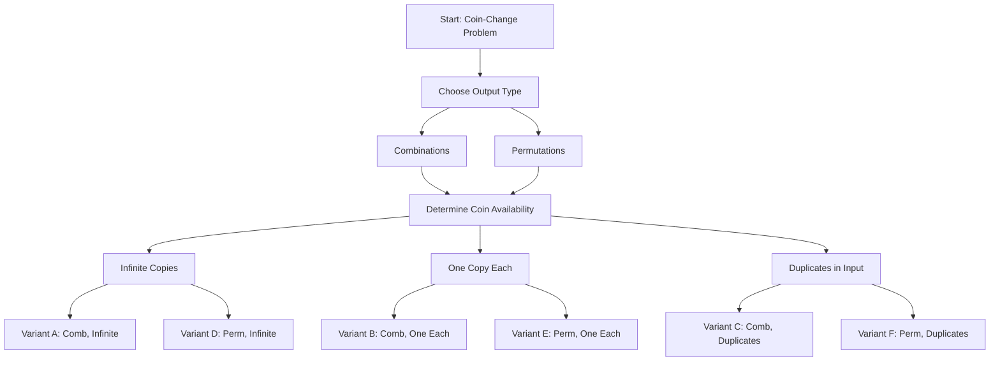

### 3.2 Permutations Tree Diagram (Infinite Coins)

For the simplest permutation case (infinite coins), the tree structure is as follows:

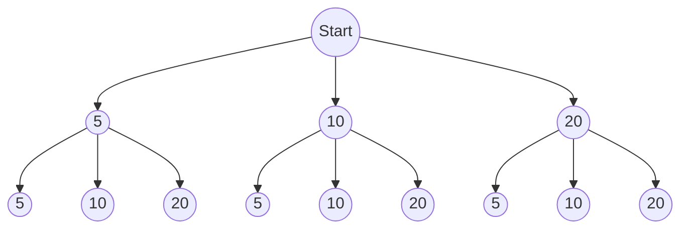

Each level of the tree represents the addition of another coin, with each branch corresponding to one of the available coin types.

### 3.3 Combinations with an Index

To enforce non-decreasing order (and avoid duplicate sets) in combinations, consider the following simplified decision diagram:

```mermaid
flowchart TD
    Start([Start: target=20])
    Choose5([Choose coin 5 at index 0])
    Remain([Remaining target after adding 5])
    NextIndex([Move to next coin index])
    Next10([Choose coin 10])
    
    Start --> Choose5
    Choose5 --> Remain
    Remain --> NextIndex
    NextIndex --> |Reuse coin at current index| Choose5
    NextIndex --> |Or choose next coin: 10| Next10
```

Once a coin is chosen at an index, the algorithm moves forward so that combinations like [10, 5] (which is the same as [5, 10]) are avoided.

## Coin-Change Problem Variants: Example Implementations, Test Cases, and Dry-Run Diagrams

This document provides runnable Python code for six variants of the coin-change problem. For each variant we include:
- A brief description of the approach.
- The full Python implementation.
- A test case with expected outputs.
- A simplified dry-run decision tree diagram (using Mermaid) that explains the recursion/backtracking flow.

---

### 4.1 Variant A: Combinations with Infinite Coins

**Description:**  
You have an infinite supply of each coin. Use backtracking with an index to enforce a non-decreasing order (thus avoiding duplicate combinations).  
For example, with coins `[5, 10, 20]` and target `20`, valid combinations include `[5, 5, 5, 5]`, `[5, 5, 10]`, `[10, 10]`, and `[20]`.

### Implementation

```python
def coin_combinations_infinite(coins, target):
    results = []
    def backtrack(i, current, total):
        if total == target:
            results.append(current[:])
            return
        if total > target or i >= len(coins):
            return
        # Option 1: use coin at index i (reuse allowed)
        current.append(coins[i])
        backtrack(i, current, total + coins[i])
        current.pop()
        # Option 2: move to next coin
        backtrack(i + 1, current, total)
    backtrack(0, [], 0)
    return results

# Test case for Variant A
if __name__ == '__main__':
    coins = [5, 10, 20]
    target = 20
    print("Variant A (Combinations with Infinite Coins):")
    print(coin_combinations_infinite(coins, target))
```

Dry-Run Diagram

```mermaid
flowchart TD
    A[Start: total=0, index=0, current=[]]
    B[Choose coin 5 at index 0 → current=[5], total=5]
    C[Call backtrack(index=0, current=[5], total=5)]
    D[Choose coin 5 again at index 0 → current=[5,5], total=10]
    E[Call backtrack(index=0, current=[5,5], total=10)]
    F[Eventually, total becomes 20 with current=[5,5,5,5]]
    G[Backtrack to try coin 10 at index 1, forming [5,5,10]]
    A --> B
    B --> C
    C --> D
    D --> E
    E --> F
    F --> G
```

### 4.2 Variant B: Combinations with Exactly One Copy of Each Coin

**Description:** 
Each coin may be used at most once. We again use backtracking with an index that increases on each recursive call to ensure that a coin is not reused.
For example, with coins [5, 10, 20] and target 20, the only valid combination might be [20].

Implementation

```python

def coin_combinations_one(coins, target):
    results = []
    def backtrack(index, current, total):
        if total == target:
            results.append(current[:])
            return
        if total > target:
            return
        for i in range(index, len(coins)):
            current.append(coins[i])
            backtrack(i + 1, current, total + coins[i])
            current.pop()
    backtrack(0, [], 0)
    return results

# Test case for Variant B
if __name__ == '__main__':
    coins = [5, 10, 20]
    target = 20
    print("Variant B (Combinations with One Copy Each):")
    print(coin_combinations_one(coins, target))
```

Dry-Run Diagram

```mermaid
flowchart TD
    A[Start: total=0, index=0, current=[]]
    B[Choose coin 5 at index 0 → current=[5], total=5]
    C[Call backtrack(index=1, current=[5], total=5)]
    D[Next coin from index=1: choose 10 → current=[5,10], total=15]
    E[Call backtrack(index=2, current=[5,10], total=15)]
    F[From index=2, choose 20 → current=[5,10,20], total=35 (exceeds target)]
    G[Backtrack and try coin 20 at index 0 → current=[20], total=20]
    A --> B
    B --> C
    C --> D
    D --> E
    E --> F
    F --> G
```

### 4.3 Variant C: Combinations with Duplicates in the Input

**Description:** 
The input list may contain duplicates (e.g., [5, 5, 10, 10, 20]). We first sort the coins and then use backtracking with an index while skipping duplicates at the same recursion level.
For target 20, valid combinations could be [5,5,10], [10,10], and [20].

Implementation
```python
def coin_combinations_duplicates(coins, target):
    results = []
    coins.sort()  # sort to handle duplicates
    def backtrack(index, current, total):
        if total == target:
            results.append(current[:])
            return
        if total > target:
            return
        for i in range(index, len(coins)):
            # Skip duplicate coins at the same recursive level.
            if i > index and coins[i] == coins[i - 1]:
                continue
            current.append(coins[i])
            backtrack(i + 1, current, total + coins[i])
            current.pop()
    backtrack(0, [], 0)
    return results

# Test case for Variant C
if __name__ == '__main__':
    coins = [5, 5, 10, 10, 20]
    target = 20
    print("Variant C (Combinations with Duplicates in Input):")
    print(coin_combinations_duplicates(coins, target))
```

Dry-Run Diagram
```mermaid
flowchart TD
    A[Start: total=0, index=0, current=[]]
    B[Sorted coins: [5,5,10,10,20]]
    C[Choose first 5 (index 0) → current=[5], total=5]
    D[Call backtrack(index=1, current=[5], total=5)]
    E[At index 1, choose second 5 → current=[5,5], total=10]
    F[Call backtrack(index=2, current=[5,5], total=10)]
    G[From index 2, choose 10 → current=[5,5,10], total=20]
    H[Found valid combination: [5,5,10]]
    A --> B
    B --> C
    C --> D
    D --> E
    E --> F
    F --> G
    G --> H
```

### 4.4 Variant D: Permutations with Infinite Coins

**Description:** 
Here, order matters and coins may be reused indefinitely. The solution space is like a k-ary tree, where each recursive call can choose any coin.
For example, with coins [5, 10, 20] and target 20, valid permutations include various orderings of [5,5,5,5], [5,5,10] (and its rearrangements), [10,10], and [20].

Implementation
```python
def coin_permutations_infinite(coins, target):
    results = []
    def backtrack(current, total):
        if total == target:
            results.append(current[:])
            return
        if total > target:
            return
        for coin in coins:
            current.append(coin)
            backtrack(current, total + coin)
            current.pop()
    backtrack([], 0)
    return results

# Test case for Variant D
if __name__ == '__main__':
    coins = [5, 10, 20]
    target = 20
    print("Variant D (Permutations with Infinite Coins):")
    print(coin_permutations_infinite(coins, target))
```

Dry-Run Diagram
```mermaid
flowchart TD
    A[Start: total=0, current=[]]
    B[Choose coin 5 → current=[5], total=5]
    C[Call backtrack(current=[5], total=5)]
    D[From current=[5], choose coin 5 again → current=[5,5], total=10]
    E[Call backtrack(current=[5,5], total=10)]
    F[Eventually, reach current=[5,5,10] → total=20]
    G[Valid permutation found: [5,5,10]]
    A --> B
    B --> C
    C --> D
    D --> E
    E --> F
    F --> G
```

### 4.5 Variant E: Permutations with Exactly One Copy of Each Coin

**Description:** 
Each coin is available only once. We use a visited (or used) array to ensure no coin is reused.
For coins [5, 10, 20] and target 20, the only valid permutation is [20] (since other sums would require more coins).

Implementation

```python
def coin_permutations_single(coins, target):
    results = []
    used = [False] * len(coins)
    def backtrack(current, total):
        if total == target:
            results.append(current[:])
            return
        if total > target:
            return
        for i in range(len(coins)):
            if not used[i]:
                used[i] = True
                current.append(coins[i])
                backtrack(current, total + coins[i])
                current.pop()
                used[i] = False
    backtrack([], 0)
    return results

# Test case for Variant E
if __name__ == '__main__':
    coins = [5, 10, 20]
    target = 20
    print("Variant E (Permutations with One Copy Each):")
    print(coin_permutations_single(coins, target))
```

Dry-Run Diagram

```mermaid
flowchart TD
    A[Start: total=0, current=[], used=[F,F,F]]
    B[Choose coin 20 (index 2) → current=[20], total=20, used=[F,F,T]]
    C[Total equals target; add [20] to results]
    A --> B
    B --> C
```

### 4.6 Variant F: Permutations with Duplicates in the Input

**Description:** 
The input may include duplicates (e.g., [5, 5, 10, 10, 20]), and order matters. Use a dictionary (Counter) to track how many of each coin remain available.
For target 20, valid permutations include [20] and all distinct orderings of [5, 5, 10] and [10, 10].

Implementation

```python
from collections import Counter

def coin_permutations_duplicates(coins, target):
    counter = Counter(coins)
    unique_coins = list(counter.keys())
    results = []
    def backtrack(current, total):
        if total == target:
            results.append(current[:])
            return
        if total > target:
            return
        for coin in unique_coins:
            if counter[coin] > 0:
                counter[coin] -= 1
                current.append(coin)
                backtrack(current, total + coin)
                current.pop()
                counter[coin] += 1
    backtrack([], 0)
    return results

# Test case for Variant F
if __name__ == '__main__':
    coins = [5, 5, 10, 10, 20]
    target = 20
    print("Variant F (Permutations with Duplicates in Input):")
    print(coin_permutations_duplicates(coins, target))
```

Dry-Run Diagram

```mermaid
flowchart TD
    A[Start: total=0, current=[], counter: {5:2, 10:2, 20:1}]
    B[Choose coin 5 → current=[5], total=5, counter: {5:1, 10:2, 20:1}]
    C[Choose coin 5 again → current=[5,5], total=10, counter: {5:0, 10:2, 20:1}]
    D[Choose coin 10 → current=[5,5,10], total=20, counter: {5:0, 10:1, 20:1}]
    E[Found valid permutation: [5,5,10]]
    A --> B
    B --> C
    C --> D
    D --> E
```

## 4. Example Implementations

Below are example implementations for each of the six variants.

### 4.1 Variant A: Combinations with Infinite Coins

```python
def coin_combinations_infinite(coins, target):
    results = []
    def backtrack(i, current, total):
        if total == target:
            results.append(current[:])
            return
        if total > target or i >= len(coins):
            return
        # Option 1: use coin at index i (reuse allowed)
        current.append(coins[i])
        backtrack(i, current, total + coins[i])
        current.pop()
        # Option 2: move to next coin
        backtrack(i + 1, current, total)
    backtrack(0, [], 0)
    return results
```

### 4.2 Variant B: Combinations with Exactly One Copy of Each Coin

```python
def coin_combinations_one(coins, target):
    results = []
    def backtrack(index, current, total):
        if total == target:
            results.append(current[:])
            return
        if total > target:
            return
        for i in range(index, len(coins)):
            current.append(coins[i])
            backtrack(i + 1, current, total + coins[i])
            current.pop()
    backtrack(0, [], 0)
    return results
```

## 5. Generalization to Other Problems

These approaches extend beyond coin-change problems and can be applied to various backtracking challenges such as:

- **Word Break / String Slicing:**  
  Splitting a string into valid words by using an index to enforce order.
  
- **Decode Ways:**  
  Converting a string of digits into possible letter messages (e.g., "12" → "AB" or "L"), where each valid partition is similar to selecting a coin.

The core concept in all these problems is tracking which elements have been used (or which positions in the sequence have been reached) and ensuring that choices adhere to the problem's constraints—whether that's enforcing order, limiting reuse, or accounting for duplicate counts.

## 6. Summary & Takeaways

- **Six Variants:**  
  The coin-change problem splits into six variants based on:
  - **Output Type:** Combinations vs. Permutations.
  - **Coin Availability:** Infinite copies, one-of-each, or duplicates in the input.
  
- **Key Techniques:**  
  - **Combinations:**  
    - Use an index to enforce non-decreasing order and prevent duplicate arrangements.
  - **Permutations:**  
    - For one-of-each coin: use a visited set or array.
    - For duplicates: use a dictionary (or `Counter`) to track coin counts.
  - **Infinite Coins:**  
    - Model the solution space as a k-ary tree, where each node branches into all available coin types.
  
- **Broader Applications:**  
  These strategies are widely applicable to various backtracking and dynamic programming challenges, such as string segmentation, word break problems, and decode ways.


This version ensures each coin is used at most once by advancing the index after each selection.

### Graphs

1. The size of the graph is the number of nodes in the graph.
2. The empty graph has size zero
3. If 2 nodes are connected by the edge then they are called neighbors
4. The degree of a node is the number of edges it has.
5. Can have multiple source nodes
6. A path is a list of edges such that each node (but the last) is the predecessor of the next node in the list.
7. A cycle is a path where first and last nodes are the same.

Differences
Directed graph

- Single directional edge
- 2 nodes won't make a cycle. need at least 3 nodes
- A directed graph is strongly connected if there is path from every node to every other node.
- A directed graph is weakly connected if the underlying undirected graph is connected.

Undirected graph - Bi directional

- Bi-directional edge
- 1 node can make a cycle
- A undirected graph is connected if there is a path from every node to every other node.

An undirected graph is one in which edges do not have a direction. The connection is bijective
A directed graph is one in which edges have direction

If a directed graph goes from A -> D,

- We call A as source and D as destination of the edge
- The in-degree of the node is the number of in-edges it has
- The out-degree of the node is the number of out-edges it has
- A node with 0 out-edge is called a sink. (Eg leaves in a tree)

Number of nodes in the graph - vertices marked as V / N
Number of edges in the graph - vertices marked as E

Linear time solution for graph problems will be O(V + E)

But for tree problems we don't take into account the edges i.e E, because the count of E in the tree is proportional to number of vertices ie. V ~ E
Hence, E = V - 1

For a tree we do 3 passes 1 pass top-down and 1 pass bottom-up so for each node - O(2N)
and every edge is traversed once or twice O(E)
But N ~ E -> O(2N + N) -> O(3N) -> O(N)

The number of edges is independent of the number of nodes in the graph, hence we need to know the edges and that's why it's included in the calculation of Time Complexity.

Nodes that are connected are called predecessor and successor.
Predecessor - Parent node
Successor - Child node

Example A -> D, edge is an out-edge of A and in-edge of D

#### Hints to determine if it's a graph algorithm

1. When you are given a set of objects with **pairwise relationship** between them

2.

### Connected Components

A subset of the nodes of the graph is called connected components, if there is a path for every node in the subset to every other node in the subset.

Node X is reachable from Node Y, if there is a path from Y to X.

### Graph Representation - 4 Types

1. Adjacency List (Adjacency Set)
   a. Implementation 1 - Each node carries a list of it's successors

   ```python
   class GraphNode:
      def __init__(self, value):
         self.value = value
         self.successors = [] # each node carries a list of it's successors
         # self.predecessors = [] # for parent node references
   
   adjSet of GraphNode = [A, B, C, D, E, F, G, H, I]

   # predecessors are usually asked for data structure design for Graph
   ```

   b. Implementation 2 - A Hashmap of parent -> children

   ```python
   dictionary = {
      A: [E],
      B: [C],
      C: [],
      D: [D, A],
      E: [B, G]
      F: [E]
      G: [D]
   }
   ```

2. Adjacency Matrix
   a. One simple way of representing a graph is by using an adjacency matrix. V x V
   b. A 2-D array has a mark at [i][j] where there is an edge from node i to node j.
   c. The adjacency matrix is symmetric over the main diagonal of an undirected graph
   d. The index of the matrix is the node ID
   e. Only suitable for representing smaller graphs, because there maybe lot of empty spaces in the matrix. Hence it's suitable for dense graphs that have many edges.
   f. Can be suitable for directed graphs, nodes won't be symmetrical over the main diagonal.

3. Co-ordinate matrix
   - A representation that uses matrix as nodes.
   - Each node edges out to the neighbor surrounding it.

4. Edge Set
   a. Only one not suitable for DFS or BFS
   b. Special algorithm called Union Find which is specially for edge set input.
   c. An edge set representation uses a set of nodes and set of edges
      Example
      edges = [[D, A], [A, E], ...]
      nodes = {A, B, C, D, E}
   d. For directed graphs, strictly the first entry is parent and the second entry is child.
               parent, child
   Example edges = [[D, A], [A, E], ...]
   5. When edge set is given it's not always suitable to solve the graph using Union Find. So it will be best to convert to adjacency list or adjacency matrix and then solve the graph

Convert edge set to adjacency list (HashMap)

```python
# undirected graph A - E
for i in range(len(edges)):
   dictionary[edges[i][0]].append(edges[i][1])
   dictionary[edges[i][1]].append(edges[i][0])

# directed graph A -> E
for i in range(len(edges)):
   dictionary[edges[i][0]].append(edges[i][1])

```

DFS

- for general graph problems represented by Adjacency List, Adjacency Matrix, Map Matrix
- Visit all the nodes in the graph
- Count all the connected components of the graph
- Search Paths
- Cycle Detection
- Topological Sort (parent -> child, and it has to be always directed graph)
- Tarjan's critical connections
- Matrix

2 templates - Bottom up or Top down are all about visiting every nodes once. ie. count the number of nodes, maximum path sum, find the longest path in the tree etc
1 template - backtracking, search all the path of the tree which is different from searching all the nodes in a tree. It will be combination of preorder and postorder

BFS - search for the shortest path
Union Find - for graphs represented as edge set

For DFS, adjacency list and adjacency matrix are efficient because we need to have constant time access to the successor nodes. Adjacency matrix can be slightly less efficient we need to skip empty spaces in the matrix to get the child node.

### Template Visit all nodes in a Graph

Scenario - Visit all nodes in a Graph
Solution - Recursion and keep a global set of visited nodes
Complexity - O(N + E)

```python
class Node:
   def __init__(self, value=None):
      self.value = value
      self.children = ["""Successor nodes"""]
   
# driver function
def depth_first_search_graph(graph):
   """
   @graph: list[Node]
   @rtype: None
   """
   # recursive function
   def depth_first_search_helper(node, visited):
      """
      @node: Node
      @visit: set{Node}
      @rtype: None
      """
      # base case ignore visited nodes
      if node in visited:
         return

      # General case: do whatever the question asks for whether print or clone
      print(node.value)
      # mark node as visited
      visited.add(node)

      # recursively call dfs function on children nodes of node
      for child in node.children:
         depth_first_search_helper(child, visited)
      

   visited = set()
   # if we don't know the source nodes then we have to call dfs on every source node in the graph
   for node in graph: 
      depth_first_search_helper(node, visited)


```

When to use BFS?
Shortest path from A to B (unweight)
Graph of unknown or even infinite size, e.g. knight shortest path
Dijkstra Intro | Shortest Path in a Weighted Graph

#### Topological Sort

<https://leetcode.com/discuss/general-discussion/1078072/introduction-to-topological-sort>

The topological sort of a directed graph is a sequence to visit **all** nodes in the graph in which the predecessor comes before the successors. (i.e parent before children)
Example pre-requites for a course, install packages with multiple dependencies.

A cyclic graph has no topological order

Though it looks like a pre-order i.e parent > child. It still is solved using DFS, because all the parents should come before children. The keyword all is important. But using post-order will make sure all the parents are printed before children.

The postorder template can only find out the order when there is no cycle in the graph.

Algo - dfs

1. Postorder
2. Store items in result lists
3. Reverse - result[::]

Algo - bfs

1. Using a hashmap, where key is the node and value is the number of parents to that node.
2. Start with node with zero parents and remove it.

All of the graph questions with global visited set() will have a linear time complexity. Only when the visited is the preorder set, and there is no backtracking. - O(V + E)

### Search Paths

Scenario - Visit all the paths in the graph.
Solution - Keep a stack of nodes keeping log stack of recursion.
Complexity - Worst Case O(neighborCount^Depth)

Time Complexity
Not dependent on just V and E,
We need to have an estimation of the depth of the graph and
the average number of children for every node in the graph
Example if every node has 4 children then it's 4^D

### Cycle Detection

For a non-cyclic graph - Every path ends up in a sink
For a cyclic graph - Sometimes you come across sink and sometimes you go through a node that is already in the path. A cycle path will meet the node twice.

Is Cycle Detection template
Time Complexity

- without the global visited set - O(child ^ D * N)
- with both global and local set - O(V + E)

You can use states to mark
Visited - as state 2
Visiting i.e as state 1
Never visited before - state 0
Pre order set the dict[node] = 1
Post order set the dict[node] = 2

```python

def isCyclicDirectedGraph(graph: dict) -> bool:
   def dfs(node: int, path: set()) -> bool:
      # Base Case - if we see the same node twice
      if node in path: # if dict[node] == 1
         return True

      # Use global visited set to cache the values
      if node in visited: # if dict[node] == 2
         return False

      # General Case
      visited.add(node) # dict[node] = 2, because this is visited.
      path.append(node) # dict[node] = 1, because this is visiting
      for child in graph[node]:
         if dfs(child, path):
            return True
      # backtracking
      path.remove(node) # dict[node] = 2
      return False
   
   visited = set()
   for node in graph:
      if dfs(node, set()):
         return True
   
   return False

```

Cycle Detection - undirected graph
Any nodes in cycle will recur in path, except the case node1 -> node2 -> node1
The recurrence of the predecessor node should be ignored.

```python
def isCyclicUndirectedGraph(graph: dict) -> bool:
   def dfs(node: int, parent: int) -> bool:
      # Base Case - if we see the same node twice
      if node in visited:
         return True

      # General Case
      visited.add(node)
      for child in graph[node]:
         if parent != child and dfs(child, node):
            return True
      
      return False
   
   visited = set()
   for node in graph:
      if node not in visited:
         if dfs(node, -1):
            return True
   
   return False
```

All Acyclic1 graphs are bipartite. A cyclic2 graph is bipartite iff all its cycles are of even length. Some common examples of a bipartite graph include star graphs3, grid graphs4 and gear graphs5.

DFS Matrix
Node ID -> (row, col)

#### DFS Search Matrix

```python
def dfs_helper(i: int, j: int, matrix: list) -> None:
   # Base Case, catches out of bounds, invalid and visited nodes.
   if i < 0 or j < 0 or i >= len(matrix) or j >= len(matrix[0]) or matrix[i][j] != "X":
      return

   # General case, do whatever the question asks for the node.

   matrix[i][j] = "G"

   # Recursively call DFS function on children nodes of node.
   dfs_helper(i + 1, j, matrix)
   dfs_helper(i - 1, j, matrix)
   dfs_helper(i, j + 1, matrix)
   dfs_helper(i, j - 1, matrix)

   # backtracking optional

```

#### Puzzle Problem - 1

```python
dfs_helper(0, 0, matrix)

def dfs_helper(i: int, j: int, matrix: list) -> bool:
   if i < 0 or j < 0 or i >= len(matrix) or j >= len(matrix[0]) or matrix[i][i] != 1:
      return False

   if i == len(matrix) - 1 or j == len(matrix[0]) - 1:
      return True
   
   matrix[i][j] = 0 # visited

   # Recursively call DFS function on children nodes of node.
   exit_found = dfs_helper(i + 1, j, matrix) or dfs_helper(i - 1, j, matrix) or dfs_helper(i, j + 1, matrix) or dfs_helper(i, j - 1, matrix)

   return exit_found
```

We can include the backtracking above, but it will only slow down the function, because it becomes a path finding problem which is exponential

#### Puzzle Problem - 2

Given a puzzle matrix where 1 denotes pathways and 0 denotes walls. At any pathway, you may walk one block to the four neighboring pathways on the top, bottom, left, or right. The entrance of the puzzle is at the top-left corner. The exit is at the bottom-right corner.

Find out the total number of ways to walk through the puzzle.

Input

```bash
[
   [1, 1, 0, 1, 0, 1],
   [1, 0, 1, 0, 1, 1],
   [1, 1, 0, 0, 0, 1],
   [1, 0, 1, 0, 1, 1],
   [1, 1, 0, 1, 0, 1]
]
```

Output

```bash
7
```

```python
dfs_helper(0, 0, matrix)

def dfs_helper(i: int, j: int, matrix: list) -> bool:
   if i < 0 or j < 0 or i >= len(matrix) or j >= len(matrix[0]) or matrix[i][i] != 1:
      return 0

   if i == len(matrix) - 1 or j == len(matrix[0]) - 1:
      return 1
   
   matrix[i][j] = 0 # visited

   # Recursively call DFS function on children nodes of node.
   ways = dfs_helper(i + 1, j, matrix) +
      dfs_helper(i - 1, j, matrix) +
      dfs_helper(i, j + 1, matrix) + 
      dfs_helper(i, j - 1, matrix)

   matrix[i][j] = 1 # backtracking, because we need to reset the path at the intersection.

   return exit_found
```

#### Puzzle Problem - 3

Print all path ways

```python

dfs_helper(0, 0, matrix)
result = []

def dfs_helper(i: int, j: int, matrix: list, path: list) -> bool:
   if i < 0 or j < 0 or i >= len(matrix) or j >= len(matrix[0]) or matrix[i][i] != 1:
      return

   if i == len(matrix) - 1 or j == len(matrix[0]) - 1:
      result.append(list(path))
      return
   
   matrix[i][j] = 0 # visited
   path.append([i, j])

   # Recursively call DFS function on children nodes of node.
   dfs_helper(i + 1, j, matrix)
   dfs_helper(i - 1, j, matrix)
   dfs_helper(i, j + 1, matrix)
   dfs_helper(i, j - 1, matrix)

   matrix[i][j] = 1 # backtracking, because we need to reset the path at the intersection.
   path.pop()
```

#### Interview Question

A robot is placed in placed in a room, the initial. The location of the robot is unknown, you have remote that could move the robot in adjacent block at one of the four directions - top, left, right, bottom.
The methods given are moveUp(), moveDown(), moveLeft(), moveRight(). 
If there is no more room on the direction, the robot returns false without moving. Otherwise the robot moves a step into the direction and return true. Find out the area of the room.

Eg


A room like such has an area - 12

```python

```

#### BFS

- Shortest Path
- Drop leaf nodes
- Dijkstra's Shortest Path

#### Think in BFS

- FIFO Queue or Priority Queue? - Weighted - PQ (not only edges but vertices as well carries the weight)
- Starting Nodes - Push all the source nodes into the queue.
- Destinations - when the nodes are popped find out if they are the destination.
- Mark a node visited when pushing or popping?
  - When the edge is weighted and vertices/nodes are not weighted - popping
  - The node is weighted and the edge is not weighted - pushing
- When to terminate the search?
  - Destination as the node is popped out of the queue, you do a check
  - Destination as a child node we are about to push to the queue

#### Shortest Path

- Scenario: Find the shortest path starting from sources node(s)
- Solution: Select the optimal search node(s) to search for destination by BFS
- Complexity - Linear

#### Puzzle Problem - 4

Find shortest path

```python
from collections import deque

def shortest_path(matrix: list) -> int:
   if not matrix or len(matrix) == 0 or matrix[0][0] == 0:
      return -1
   
   neighbors = [[-1, 0], [1, 0], [0, 1], [0, -1]]
   ROW = len(matrix)
   COL = len(matrix[0])
   queue = deque([0, 0, 1]) # (i, j, level)
   matrix[0][0] = 0 # mark as visited

   while queue:
      x, y, level = queue.popleft()
      for shiftX, shiftY in neighbors: # visit the neighbors
         i j = x + shiftX, y = y + shiftY
         if i >= 0 and j >= 0 and i < ROW and j < COL and matrix[i][j] == 1:
            if i == ROW - 1 and j == COL - 1: 
               return level + 1  # destination reached
            
            queue.append([i, j, level + 1]) # enqueue the neighbor
            matrix[i][j] = 0 # set to visited


      return -1
```

#### Matrix BFS

Find the length of the shortest path from the top left of the grid to the bottom right

```python
# Shortest path from the top left to bottom right
def bfs(grid):
   ROWS, COLS = len(grid), len(grid[0])
   visited = set()
   queue = deque()
   queue.append((0, 0))
   visited.add((0, 0))
   length = 0
   neighbors = [[0, 1], [1, 0], [-1, 0], [0, -1]]

   while queue:
      for i in range(len(queue)):
         row, col = queue.popleft()
         if row == ROWS - 1 and col == COL - 1:
            return length
         
            for dr, dc in neighbors:
               new_row = dr + row
               new_col = dc + col
               if new_row < 0 or new_col < 0 or new_row >= ROWS or new_col >= COLS or (new_row, new_col) in visited or grid[new_row][new_col] == 1:
                  continue

               queue.append((new_row, new_col))
               visited.add((new_row, new_col))
      length += 1
   
   print(bfs(grid))
         

```

#### Drop leaf nodes

Scenario: Delete the nodes with minimum degrees from the graph
Solution: Initiate BFS from leaf nodes
Complexity: O(N)

#### Dijkstra's algorithm

Scenario: Find the shortest path from source to destination
Solution: BFS with a priority queue
Complexity: O(N^2)

#### Divide & Conquer

What is divide and conquer?
Break a problem into 2 sub problems, solve each sub problems independently and then combine solutions to sub-problems to form solution to original problem.

What is greedy or dynamic programming?

- They both build up the solution incrementally.
- Greedy takes the choice that seems most optimal at each stage, and generates the next step based on the previous optimal.
- Every node in the recursion tree will be cached in the DP cache.
- Dynamic Programming takes every path of choices into consideration and generates output by comparing the gain of every sub-choice.
- DP leads to final optimal solution for sure, while greedy may not, because local optimal choice at every stage may not be best for the global problem.

What is the time complexity for the following method?
O(2^n)

```python
def fibonacci(n):
   if n <= 2:
      return 1
   return fibonacci(n - 1) + fibonacci(n - 2)
```

1. First step is to find the number of unique keys in the tree? => `n`
2. What the cache is and how many blocks do we need in the cache?
   1. Think about if it's better to use a hashtable cache or an n-ary cache.
   2. if the keys are sequentially then best to use an array
   3. if keys are Non-sequential then it's best to use a hash table

In the above example the keys are sequential then its best to use the n-array cache.

```python
# Top-down DP
def fibonacci(n, dp): # dp[] of size n + 1
   if n < 2:
      return 1
   if dp[n] > 0:
      return dp[n]
   dp[n] = fibonacci(n - 1, dp) + fibonacci(n - 2, dp)
   return dp[n]
```

Note - A common practice in DP is to initial the cache with N + 1, because we want to include an 0, "", empty set

##### Memoization DP

During the recursion process. After we have solved the sub problems, we store the solution. So that when we see the problem again we return the stored solution directly, instead of solving the sub problem again.

So each sub-problem only enter once.

#### Why DP?

What is the space complexity for the following method.

2 common types of recursion tress
0/1 tree - it's usually picking a sublist of items from a list of items. It's like subsequence of items you want to pick from the given item.. Usually they are called selection problems, because we are trying to decide whether we are selecting the current item or not.
N-ary tree - When it comes to n-ary tree, it's usually slicing up a rod

For some questions in the DP formula if the current item depends on a constant number of former items (like eg Fibonacci) - `dp[i] = dp[i-1] + dp[i-2]`, the final step to optimize the cache, is to get rid of anything before `i - 2`, so we can get rid of linear cache and have 2 variables to cache 2 former values. In such cases it will O(1) space.

First step
Build the recursion tree either 0/1 tree or N-ary tree.

Second step
Memoization - each step/node will be stored in the cache as a key
If the keys are sequential, you can go with an array
If not sequential, then you can go with hash table or hashset

Third Step
After memoization we will convert the top/down solution into bottom/up solution we will start filling up the cache starting from the base case without recursion.

```python
# Bottom-up DP
fibonacci(n):
   if n == 1:
      return 1
   prev, cur = 0, 1
   while n > 1:
      prev, cur = cur, prev + cur
      n = n - 1
   
   return cur
```

#### Top-Down vs Bottom-up

Memoization is top-down. DP is bottom-up

#### How to we approach any DP solution

First recursion, then memoization, then reverse

- First break the problem into sub-problem. Write the recursion tree.
- Second, store the visited sub-problem solutions. So we enter into each sub-problem only once.
- Last, we reverse the direction from top-down to bottom-up.

In short the key to DP is recursion.

When it's a symmetric problem, we fill the cache from left to right. We make the left as base case and right as bottom case.

#### Count combinations - climbing stairs

A child is running up a staircase with n-steps, and can hope either one step, two step or 3 steps. Implement a method to count how many possible ways the child can run up the stairs.
This is a typical slicing question using n-ary tree.

```
            N
         /  |  \
      N-1  N-2  N-3
```

```python
# This is a section problem hence it will be an n-ary recursion tree
def countWays(n):
   if n == 0 or n == 1:
      return 1
   if n == 2:
      return 2
   return countWays(n - 1) + countWays(n - 2) + countWays(n - 3)
```

#### House robber

A neighborhood has an alarm system which alerts the police if 2 adjacent houses are robbed the same night. Give a list of non-negative integers representing the amount of money in each house, determine the maximum amount of money you can rob tonight without alerting the police.

```
       bottom & base           recursion calls here (i)
houses = [22, 12, 8, 15, 20, 17]
         i = 0, i = -1
Max profit - [22, 15, 17]

To approach this DP problem, think **about** where is the base case.
```

1. Where is the base case - empty array or 1 hosue array (for max profit), this problem is symmetric if you choose the base case is left or first house or last house this is when i = 0, i = -1

```


dp[i] = max(dp[i], )

dfs(i)

   dfs(i - ?)

maxprofit(0~i) {
   # Case 1: taking the current house # This is the pattern for Binary Tree you take current value + whatever is remaining of the input
   case_1 = value[i] + maxprofit(i-2)  # since we can't get adjacent house i - 1 should be skip
   # Case 2: If we do not take current house
   case_2 = maxprofit(i - 1)

   return max(case_1, case_2)

}
```

Note: when the question has maximum amount, it is very likely that the return statement has a max
Base Case
1 house
2 houses

General cases:
At each house i, the choices to make are

1. Rob the house - gain1 = houses[i] + maxRob(i + 2, houses) -> gain = houses[i] + dp[i + 2]
2. Skip the house - gain2 = maxRob(i + 1, houses) -> gain = dp[i + 1]

dp[i] = max(gain1, gain2)

#### Count combinations, decode ways

```
Example decode 121
         start from right to left

               121
            w  / \ A
             1    12
               L /  \ B
               ""     1
         
         start from left to right
              121
            A /  \ L
            21    1
         B /  \ W
         1
```

A message containing digits from A-Z is being decoded to numbers using the following mapping.
"A" -> 0
"B" -> 1
..
..
..
"Z" -> 26
Given an encoded message containing digits, determine the total number of ways to decode it.

Given code "26", there are 2 ways to decode "Z", "BF"
Given code "121042", there are total of 2 ways to decode

```
start from right to left

          121042
            | B
          12104
            | D
           1210
            | J
           12
        L /   \ B
        " "    1

num of ways = 2, the leaf nodes

if 1 <= last 2 digits <= 25:
   case 1 -> dfs(i - 2) + dfs(i - 1)

if last digit == 0 and before last digit == "1" or "2":
   case 2 -> dfs(i - 2)

if last 2 digit > 26 or < 10:
   case 3 -> dfs(i - 1)

General case:

we need bases cases hence we need to manually fill up the answers
dp[i-1]
dp[i-2]

DP cache
""  1   2   1   0   4   2
-   -   -   -   -   -   -
1   1   2   3   2   2   2
_   _   _   _   _   _   _

    A  AB  ABA  ABJ ABJD ABJDB
       L    W   LJ  LJD  LJDB
           AW

Base Case:
input == "" -> 
input == "0" -> invalid


General case at index i
When ch[i] == "0":
   ch[i - 1] == "0" or ch[i - 1] > "2"  -> invalid
   ch[i - 1] == "1" or "2" -> case(i - 2)
When ch[i] != "0"
   ch[i - 1] and ch[i] combined ranges between 1 - 26 (20 excluded) -> case(i - 2) + case(i - 1)
   ch[i - 1] and ch[i] combined ranges <= 9 or > 26 -> case(i - 1)
```

#### Sample code

```python
def decode_ways(code: str) -> int:
   if not code or code[0] is "0":
      return 0
   
   prev, cur = 1, 1 # base case
   for i in range(1, len(code)):
      if code[i] is "0":
         if code[i - 1] is "0" or code[i - 1] > "2":
            return 0
         ways = prev # when current number is 10 or 20 case(i - 2)
      else:
         if code[i - 1] is "1" or code[i - 2] is "2" or code[i] <= "6":
            ways = prev + cur
         else:
            ways = cur
      prev = cur
      cur = ways
   
   return cur
```

#### Weighted Meetings

You are given a series of unsorted meetings. You need to schedule them. So no two meetings can be overlapped. Goal is to find maximum weight subset of mutually non-overlap meetings.

```python
class Meetings:
   def __init__(self):
      self.startTime
      self.endTime
      self.weight
```

a. 0am - 6am, weight - 5
b. 1am - 4am, weight - 6
c. 3am - 5am, weight - 12

Max profit without overlapping - c, 12 + h, 4 = 16

For every interval, we have to decide whether we need to include it or not, then this becomes a selection problem.

Also, when selecting the current interval we have to compare with the previous and next intervals to make the decision to include it or not. This becomes bi-directional and DP is one directional. We can use a visited set in this and avoid the previous cases, but it is still not feasible.

```
           a ~ h
      a  /       \ !a
      g - h      b - h
```

Sort by start time -> right is  base, left is recursion
This problem is not symmetric because if we choose endTime then there one of the overlapped intervals can't be included in the index i. Only if we sort the intervals in endTime then we can use the left as the base

```
Base cases
- No meeting
- First meeting or last meeting

General Case
At each meeting i, the choices to make are
1. Attend meeting i
   gain = meeting[i] + maxWeight(meeting[k to n - 1])
   k is the first meeting after i ends
2. Skip meeting
   gain = maxWeight(meeting[i + 1 to n - 1])
```

#### Approaching the DP problem

Why do we need to sort first? Because we need a pattern to break the problem into a sub problem. That's the key to recursion.

After sorting it, we define the sub-problem as sub-problem(k - 1). So all sub-problems are in the sane format.
Time and Space complexity of the recursive solution?
Time Complexity - O(n*log(n))
Space Complexity - O(n)

```python
def max_weight_meeting_schedule(meetings):
   
   def max_weight_meeting_schedule_rec(meetings, k):
      if k < 0:
         return 0
      # Case 1; Keeping meetings[k], then skip all the meetings that overlap with k.
      j = k - 1
      # or binary search
      while j >= 0 and meetings[j].endTime > meetings[k - 1].startTime:
         j -= 1 # search for jth meeting that is not overlapped with chosen meeting
      case_1 = meetings[k].weight + max_weight_meeting_schedule_rec(meetings, j)

      # case 2, not keeping meeting
      case_2 = max_weight_meeting_schedule_rec(meetings, k - 1)
      
      return max(case_1, case_2)
   
   meetings.sort(key=lambda x: x.endTime))
   return max_weight_meeting_schedule_rec(meetings, len(meetings) - 1)

```

#### Approaching the DP solution

Recursion to memoization, use a cache

```python
def max_weight_meeting_schedule(meetings):
   
   def max_weight_meeting_schedule_mem(meetings, k):
      if k < 0:
         return 0
      
      if k + 1 > 0:
         return mem[k + 1]
      


      # Case 1; Keeping meetings[k], then skip all the meetings that overlap with k.
      j = k - 1
      # or binary search
      while j >= 0 and meetings[j].endTime > meetings[k - 1].startTime:
         j -= 1 # search for jth meeting that is not overlapped with chosen meeting
      case_1 = meetings[k].weight + max_weight_meeting_schedule_mem(meetings, j)

      # case 2, not keeping meeting
      case_2 = max_weight_meeting_schedule_mem(meetings, k - 1)
      
      mem[k + 1] = max(case_1, case_2)

      return mem[k + 1]
   
   meetings.sort(key=lambda x: x.endTime))
   mem = [-1] * (len(meetings) + 1)
   return max_weight_meeting_schedule_mem(meetings, len(meetings) - 1)
```

**Recursion**
`def max_weight_meeting_schedule_rec(meetings, k):`

DP

```python
def max_weight_meeting_schedule(meetings):
   ...
   for i in range(1, len(meetings) + 1):
      ....
```

Flip recursion to Bottom-up solution
Memoization to DP
outer loops in greedy - iterate through the output variables of the recursive method

Inside of outer loop

- copy the general cases from recursion
- change recursive call to memoization cache call

It always takes n log N time.

```python
def max_weight_meeting_schedule(meetings):
   meetings.sort(key=lambda x: x.endTime))
   mem = [0] * (len(meetings) + 1)
   for k in range(1, len(meetings) + 1):
      # Case 1; Keeping meetings[k], then skip all the meetings that overlap with k.
      j = k - 1
      # or binary search
      while j >= 0 and meetings[j].endTime > meetings[k - 1].startTime:
         j -= 1 # search for jth meeting that is not overlapped with chosen meeting
      case_1 = meetings[k].weight + mem[j + 1]

      # case 2, not keeping meeting
      case_2 = mem[k - 1]

      mem[k + 1] = max(case_1, case_2)

   return mem[len(meetings)]
```

#### Note

Permutation Tree -> N-ary tree -> slicing problem Eg cutting rod, climbing a stair case
Combination Tree -> 0/1 tree -> selection problem (discard certain elements) -> picking sublist of items in a list of items

Whenever it's a combination problem regardless of it's copy of 1 or infinite coins, we will use the binary tree.

<https://superstudy.guide/algorithms-data-structures/graphs-trees/trees>

### Knapsack problem

```python
class Item:
   # each item has a item and a weight
   def __init__(self, value, weight):
      self.value = value
      self.weight = weight
```

The knapsack problem with a weight of `total_vote_power / 2`. Find out any combination of states vote power add up to the exact weight limit.

```python
def tie(weights: List[int], half: int, i: int) -> bool:
   if half == 0:
      return True
   if half < 0 or weights.length:
      return False
   return tie(weights, half - weights[i], i + 1) or tie(weights, half, i + 1)
```

### Bit Manipulation

| A   | B   | A & B | A or B | A ^ B |
| --- | --- | ----- | ------ | ----- |
| 1   | 0   | 0     | 1      | 1     |
| 0   | 1   | 0     | 1      | 1     |
| 1   | 1   | 1     | 1      | 0     |
| 0   | 0   | 0     | 0      | 0     |

XOR is checking if 2 things are different, if its different return True
Specifically useful for checking questions where values are in pairs - Eg [5, 10, 5, 2, 1, 10, 1] => XOR each element -> gives 2, because rest of the values will cancel out.

Among 32 bits

- the left most bit will be a Signed bit and 1 is
- treated as negative
- remaining bits are for the value of the number - 2^31

Signed Left Shift [<<]
Eg - 01101111 => 11011110
int x 2 -> int << 1 = pad a zero to the rightmost bit and remove the leftmost bit.

Signed Right Shift [>>]
Remove the rightmost bit in the number and pad the same bit as the leftmost bit to the left or pad a signed bit to the left.

Unsigned Right Shift [>>>]
Remove the rightmost bit in the number and always pad a zero to the leftmost bit

Unary bitwise complement operator [~]

In most of the questions bits are treated a bitset similar to hashset with fewer space consumption.
`bitset:int = 0`

Get the kth bit - read operation

```
1010010011, k = 4 (zero based k starting from right)

1 approach
return (bitset >> k) % 2

Common Approach
bit mask
1010010011
0000010000

result = num & (1 << k)
```

Set the Kth bit - write a bit

```
result = num | (1 << k)
```

Unset a bit

```
num = num & (~(1 << k))
```

toggle a bit at the kth position

```
result = num ^ (1 << k)

0 XOR with anything will recover that anything
```

How to remove the rightmost set bit in a number?
Eg
100100
000100
= 100000

```python
mask: int = 1
while mask and number == 0:
   mask << 1
return number - mask
```

Remove leftmost set bit

```
mask: int = 1 << 31
while mask and number == 0:
   mask >>> 1
return number - mask
```

Whenever it's about finding the last set bit of finding the first set bit, it's always running a while loop

Pattern we use a counter so that if the number is zero then we don't get into a situation of running into an infinite loop.

```python
while mask & number == 0 && count < 32:
```

Gray Code
The gray code is a binary numerical system where 2 successive values differ in only 1 bit
Eg
n = 2-bit
00 - 0
01 - 1
11 - 2
10 - 3

n - 3 bit
000 - 0
001 - 1
011 - 3
111 - 7
101 - 5
100 - 4
110 - 6
010 - 2

### Bit Map

A bit map is an array that contains either 0/1 data, often used to store a sequence of True/False images

Where does a bit map apply?

- Assignment of a UserID
- Pixels in image
- tic-tac-toe game

An image is typically a boolean matrix

```
00000000000000000000000000000001 Clearly, a logical AND between any number and the mask 11 gives us the least significant bit of this number. To check the next bit, we shift the mask to the left by one.

0000 0000 0000 0000 0000 0000 0000 001000000000000000000000000000000010
```

### Priority Queue

A priority queue is an abstract data type that serves elements based on their priority.
In the priority queue, an element with higher priority is served before an element with element lower priority.

API's provided by a priority queue.
`PQ.top()` -> get the element with the highest priority in the queue.
`PQ.add()` -> add a new element to priority queue.
`PQ.pop()` -> remove the element with the highest priority in the queue.

A priority queue is usually implemented by a Heap.
A heap is a tree based data structure that satisfies the heap property.
The parent element in heap tree has a higher priority then it's children.

Min-heap - the smaller element has higher priority (increasing order)
Max-heap - larger element has higher priority (decreasing order)

Heap Property

- It is a Binary Tree
- It is a complete tree
- The parent is the highest element
- The parent node in heap tree has a higher property then it's children. Therefore the root of the tree is most prioritized.

Heapify - rearrange the heap to maintain the heap property. On an existing heap there are 2 scenarios than needs heapifying

- Add a new element E
  - put E to the leftmost vacancy at the bottom level
  - Shift up if E has a higher priority then it's parent, swap E with it's parent, repeat until E's parent has the highest priority or E is the root
  - Time - O(logN)
  - Tree height - O(logN)
  - Tree size - O(N)
- Remove the top element
  - replace the root value with the last value
  - delete the last node.
  - Shift down, if L's child C has a higher priority then L and other child, swap L and C
  - repeat until L has a higher property then both children, or L has no child.
  - Time - O(logN)

A heap tree is implemented as an array.
Eg [21, 15, 20, 11, 2, 10, 12, 5, 10, -4, -6, 4, 8, -2]
The array stores values in heap tree level by level.
Given the index k in the tree array
what is the index of the k's left child?
left child = 2 *k + 1
what is the index of the k's right child?
right child = 2* k + 2
what is the index of the k's parent?
parent = (k - 1) / 2

Implement a max heap. Add a new element

```python
class Heap:
   def __init__(self):
      self.heap = []

   def add(self, n:int):
      index = len(self.heap) # get the index of new element
      self.heap.append(n)
      while index > 0 and n > self.heap[(index - 1) // 2]:
         self.heap[index], self.heap[(index - 1) // 2] = self.heap[(index - 1) // 2], self.heap[index]
         index = (index - 1) // 2
   
   def pop(self) -> int: # remove and return top element
      if not heap: # exception
         print("exception! heap underflow!)
         return

      index, top = 0, self.heap[0]
      self.heap[0] = self.heap[-1]
      self.heap.pop()

      while 2 * index + 1 < len(self.heap()):
         left, right = 2 * index + 1, 2 * index + 2
         left_child = self.heap[left]
         right_child = self.heap[right] if right < len(self.heap) else float("-inf) # in case thr right child is out of bound
         n = self.heap[index]
         if n >= left_child and n >= right_child:
            return top
         if left_child > n and left_child >= right_child:
            self.heap[index], self.heap[left] = self.heap[left], self.heap[index]
            index = left
         else: # right_child > n and right_child > left_child
            self.heap[index], self.heap[right] = self.heap[right], self.heap[index]
            index = right
      
      return top
```

Initialize heap from a set on N elements.
Approach 1
Iterate through  each element and add() it to the heap
Time Complexity - O(NlogN)
Approach 2 Only if whole set of elements is given at once.
Put the elements in heap array in random order.
Traverse the list from end to the front
From bottom level to top level (visit array from end to begin), traverse all of the nodes and do shiftdown() for the root node on every subtree
Time Complexity - O(N)

### Python heapq

```python
import heapq
# make a min heap from an unsorted array.
heap = [6, 4, 23, 123, 11]
heapq.heapify(heap)

# add new elements to the heap
heapq.heappush(heap, -1)
heapq.heappush(heap, 3)
heapq.heappush(heap, 2)

# get the top element
print(heap[0]) # -1

# remove the element at heap top
if heap:
   heapq.heappop(heap) # pop -1
```

A min heap is built by default, unless the comparator is defined otherwise.

A way to make max heap
Built a tuple for each element as (-value, value) and the heap will sort the elements by the first entry in the tuple so the second entry are sorted decreasingly

```python
heap = [6, 4, 23, 123, 11]
heap = [(-val, val) for val in heap]
heapq.heapify(heap)

while heap:
   print(heapq.heappop(heap)[1]) # prints 123, 23, 6, 4, 1

```

### Top K items

Scenario - Get the k most wanted items from the list of items.
Solution - Keep the top k items so far in a heap with the least wanted item on heap top.

Complexity: O(Nlogk)

When do we use heapsort over quicksort and mergesort?
We use when the data set is dynamic

#### Priority Queue

- Top K items
- Heap sort dynamic data
- Periodic arrangement - Eg Task Scheduler

#### Popular Posts

Emma has made too many instagram posts. Today she will check on all the posts and likes.
Emma would like to keep k posts with highest likes and delete the rest. Please help her find out the top K more popular posts.

```
Eg
Input
posts = [(0, 39), (1,6), (2, 94), (3, 50), (4, 17), (5, 65), (6, 102), (7, 99), (8, 20), (9, 41), (10, 127), (11, 59)]
k = 5

Expected Output
[2, 5, 6, 7, 10] (not necessarily in the same order
```

#### Solution

- Use min-heap to keep track of flying element out of the list
- Use min-heap of size k that keep K maximum items so far

```python
"""
posts = [(0, 39), (1,6), (2, 94), (3, 50), (4, 17), (5, 65), (6, 102), (7, 99), (8, 20), (9, 41), (10, 127), (11, 59)]

Min-heap size = k

top -> (1,6), (4, 17), (0, 39), (3, 50), (2, 94)
if my current element is (5, 65)
top -> (4, 17), (0, 39), (3, 50), (2, 94), (5, 65)

so on 
top -> (2, 94), (6, 102), (5, 65), (7, 99), (10, 127)
"""
def k_popular_items(posts: list, k: int) -> list:
   heap = []
   posts = [(likes, post_id) for post_id, likes in posts]

   for post in posts:
      if len(heap) == k and heap[0][0] < post[0]:
         heapq.heappop(heap)
      if len(heap) < k:
         heapq.heappush(heap, post)

   return [post[1] for post in heap]
```

#### Nearest Cafe

Emma who recently moved in a new place is looking for cafes around her location in Yelp map. Help Emma find out the k nearest cafe locations to her from the list. A location is marked by the (x, y) co-ordinate.

```
Input
cafes = [(-2, 10), (1, 6), (-7, -3), (15, 3), (4, 1), (9, -7), (5, -5), (0, -11)]
emma = (0, 0)
k = 4

Expected output
[(1, 6), (-7, -3), (4, 1), (5, -5)]
```

#### Solution

```python
"""
Min heap or a max heap? - Max heap

What is the sort key?
cafes = [-(distance(cafe, emma), cafe) for cafe in cafes]

def distance(a: tuple, b: tuple) -> int:
   return (a[0] - b[0]) ** 2 + (a[1] - b[1]) ** 2

"""

```

#### Median of Data Stream

Design a data structure that supports the following 2 operations

```python
def addNum(int: number):
   ...

def findMedian() -> float:
   ...
```

#### Solution

- heap tops -> median
- max_heap & min_heap
- differ size by at most 1 - keep the sizes balanced
- if there are even number of elements in dataset -> sum(tops) / 2
- if there are odd number of elements in dataset -> top of bigger heap

### Heapsort

Scenario - Maintain the max/min a dynamic set of data
Solution - Heap
Complexity - O(nlogk) ~ O(nlogn)

#### Merge Strings

Given the length of several input strings, your task is to merge all the strings by merging two strings into one at a time.
To merge two strings into a string it takes (N + M), where N and M are the lengths of the strings.
Find out the minimum amount of time to merge all input strings into one.

```python
""""
Input 
strs = [1, 2, 3]

Expected output
9

merge 1 and 2 into time 3
merge 3 and 3 into time 6
                  total 9
"""
def merge(strings: list) -> int:
   heap = []
   for string in strings:
      heapq.heappush(heap, string)
   time += 0
   while len(heap) > 1:
      first = heapq.heappop(heap)
      second = heapq.heappop(heap)
      result = first + second
      heapq.heappush(heap, result)
      time += result
   
   return time
```

#### Merge k sorted arrays

Merge all the sorted arrays into a sorted array

- Could you do better than O(nlogn), where n is the length of the result list
- What was it like to merge 2 sorted arrays?
- In the implementation what attributes does a pointer need to refill the priority queue with the next available value when the queue top is popped?

```python
"""
Input
arrays = [
   [2, 5, 5, 9, 10],
   [3, 4, 6, 10, 19, 20, 25, 27],
   [7, 16],
   [-2, 0, 2, 14, 33]
]

Output
[-2, 0, 2, 2, 3, 4, 5, 5, 6, 7, 9, 10, 10, 14, 16, 19, 20, 25, 27, 33]

Hints:
How do we store the pointer for each sorted list in the arrays? 
Tuple (value, row, index)
"""
def merge_arrays(arrays: list) -> list:
   heap = []
   for i in range(len(arrays)):
      if arrays[i]: # add the first element of every row in heap
         heapq.heappush(heap, (arrays[i][0], i, 0)) # Tuple (value, row, index)
   result = []
   while heap:
      value, row, index = heapq.heappop(heap)
      result.append(value)
      if index + 1 < len(arrays[row]): # make sure sub-list is not empty
         heapq.heappush(heap, (arrays[row][index + 1], row, index + 1))
   
   return result
```

### Seat Assignment

There is only one row of seats in the classroom.
You are given a list of the students name and their spoken languages. Each student only speaks one language.
Assign seats so that students who speak the same language aren't adjacent.

For these kind of questions you need to find the cycle size and that will be the number of times you will pop from the heap every time.

```python
"""
Input
list = {
   "English": ["David", "Emma", "Greg", "Jack", "Jenny", "Kathy"],
   "Spanish": ["Andrea", "Augusto"],
   "French": ["Arthur", "Darcy", "Louis", "Gabriel"],
   "Russian": ["Alexa", "Elena"],
}

Output
["Kathy", "Gabriel", "Jenny", "Louis", "Jack", "Darcy", "Greg", "Elena", "Emma", "Augusto", "David", "Arthur", "Alex", "Andrea"]

What makes the period in this problem? How long is the problem?
Cycle = 2 -> English, French

In each cycle who should be seated first?
Max Heap
"English": 6
"Spanish": 2
"French": 4
"Russian": 2

if English, French are seated -> pop 2 from the heap because cycle = 2
"English": 5
"French": 3
"Spanish": 2
"Russian": 2

if English, French are seated -> pop 2 from the heap because cycle = 2
"English": 4
"French": 2
"Spanish": 2
"Russian": 2

if English, Spanish are seated -> pop 2 from the heap because cycle = 2
"English": 4
"French": 2
"Spanish": 1
"Russian": 2

if English, French are seated -> pop 2 from the heap because cycle = 2
"English": 4
"French": 1
"Spanish": 1
"Russian": 2

Once the count drops to zero delete that language from the heap
In the end if there is an element in the heap remaining with count greater than 1 then there is no output remaining. We ran out of people to pad.

Follow up
What if the students who speak the same language must be at least 2 seats away from each other.
"""
def assign_seats(ls: dict) -> list: # dict[language: list[student]]
   heap = []
   for language in ls:
      if ls[language]:
         heapq.heappush(heap, (-len(ls[language]), language)) # prioritize language by the number of speaks
   seat = []
   while len(heap) > 1:
      index1, language1 = heapq.heappop(heap) # seat 2 students every iteration
      index2, language2 = heapq.heappop(heap)
      seat.append(ls[language1][-index1 - 1])
      seat.append(ls[language2][-index2 - 1])
      if index1 < -1:
         heapq.heappush(heap, (index1 + 1, language1))
      if index2 < -1:
         heapq.heappush(heap, (index2 + 1, language2))
      
      if heap:
         index, last_language = heapq.heappop(heap)
         if index < -1:
            return None # exception cannot seat them apart
         seat.append()
```

### Rolling Movies

A cinema has a list of assignments (movie: n}, where n is the number of times to play the movie.

The cinema has it's showtime schedule split into intervals. In each interval either one movie gets played or the screen is off. The same movie must not be played twice within k intervals. Therefore until the same movie goes on again, the screen will either turn off the screen or play some other movies. Find out the minimum number of intervals it takes to finish playing the movies.

```python
"""
Input
movies = {
   "A": 6,
   "B": 4,
   "C": 1,
   "D": 2
}
k = 3

Expected output
16
(ABDABCABDABXAXXA) -> X means screen is off
"""
def rolling_movies(movies: dict, k: int) -> str:
   heap = [(-movies[movie], movie) for movie in movies]
   heapq.heapify(heap)
   
   rolling_sequence = []

   while heap:
      cache = []
      for screentime in range(k):
         if heap:
            count, movie = heapq.heappop(heap)
            rolling_sequence.append(movie)
            if count < -1:
               cache.append((count + 1), movie)
            else:
               rolling_sequence.append("X")
      
      for item in cache:
         heapq.heappush(heap, item)
      
      while rolling_sequence and rolling_sequence[-1] == "X":
         rolling_sequence.pop()
   
   return "".join(rolling_sequence)
```

#### Bucket Sort

- Linear time sorting algorithm
- Only applies to data set just a few unique numbers and hopefully many duplicates

```
Example
[2, 23, 2, 1, 1, 4, 20, 1]

Every bucket stands for 1 data point, so here we can build an array of 24 buckets

[0] * 23 => [0, 0, 0, 0, 0, 0, 0, 0, 0, 0, 0, 0, 0, 0, 0, 0, 0, 0, 0, 0, 0, 0, 0, 0]

Each bucket keeps the count of element for that bucket
Traverse the input array and basically build a histogram of count of elements in the array

[0, 3, 2, 0, 1, 0, 0, 0, 0, 0, 0, 0, 0, 0, 0, 0, 0, 0, 0, 0, 1, 0, 0, 1]

Traverse through the bucket array and print the number of times the index
[1, 1, 1, 2, 2, 4, 20, 23]

Limitation - doesn't deal with sparse elements

Sometimes we have to normalize the numbers if the numbers are ranged from 100 ~ 300
Subtract by 100, sort and then normalize the numbers
```

### 1-pointer

Scenario - Problems searching (read-only) the array. 1 pointer cannot permute the array.
Solution - Find out the property owned only by the key
Complexity - O(N)

### Two Pointer

- Brute Force  - n^2 - cacheable, sort
- Same End
- Different Ends
- Tow-pointer of Two (Sorted) arrays
- Sliding Window

### Brute force 2-pointer

Scenario - Iterating all the combinations of pairs in the array.
Solution - Double nested loops
Time Complexity - O(N^2)

### Optimal force 2-pointer

Scenario - Searching for some pairs. Permuting and swapping elements in the array.
Solution - Find out special property owned by target pair.
Time Complexity - O(N)

#### Two-Sum problem

A template for "two pointer" from different ends.

```python
i = 0
j = len(array) - 1

while i <= j: # i < j
   if ():
      # operation of index i and j
      # return statement or swapping - depending on the problem
   elif( ):
      i += 1
   else:
      j -= 1
```

### Array Partition 1

Given an array of integer and a pivot value, move numbers less than pivot to the left of numbers greater than pivot.

element > pivot on the left
element < pivot on the right
nums = [15, -1. 12, 4, 7, 11, 9 ,2, 20], pivot = 9

**Objective**
i finds elements > pivot on the left and move it to the right side
j find elements < pivot on the right and moves it to the left side
when i and j both point to elements on the wrong side,
swapping nums[i] and nums[j] gets to the right place.

**Template**

```python
nums = [15, -1. 12, 4, 7, 11, 9 ,2, 20], pivot = 9

i = 0
j = len(array) - 1

while i < j:
   if nums[i] > pivot and nums[j] < pivot:
      # operation of index i and j
      nums[i], nums[j] = nums[j], nums[i]
   elif nums[i] <= pivot:
      i += 1
   else: # nums[j] <= pivot:
      j -= 1
```

### Array Partition 2

Partition for quick sort / quick select

Given an array of integers and a pivot value, move numbers less than pivot to the left of numbers greater than the pivot. Place the pivot value between group of smaller numbers and larger numbers.

nums = [15, -1. 12, 4, 7, 11, 9 ,2, 20], pivot = 9

Step 1 - Swap pivot with the first element
Step 2 - Partition array from index 1 to the end
Step 3 - Swap pivot with the last elements of the group of smaller elements

#### 2-pointer

```python
def moveZeroes(self, nums: List[int]) -> None:
        """
        Do not return anything, modify nums in-place instead.
        """
        left = 0
        right = len(nums) - 1
        
        # Group 1: element < pivot
        # Group 2: element > pivot
        
        # Group 1: element != zero
        # Group 2: element == zero
        
        while left < right:
            if nums[left] == 0 and nums[right] != 0: # both i, j are at elements in the wrong place.
                nums[left], nums[right] = nums[right], nums[left]
            elif nums[left] != 0: # move away from the element that is supposed to be here
                left += 1
            else:
                right -= 1
```

If you want to maintain order.

```python
def moveZeroes(self, nums: List[int]) -> None:
        """
        i, j will start at the same end
        j is always moving ahead of i
        this pattern can be used to solve, quick, quicksort and other algo's
        """
        left = 0
        right = 0
        
        # Group 1: element < pivot
        # Group 2: element > pivot
        
        # Group 1: element != zero
        # Group 2: element == zero
        
        while right < len(nums):
            if nums[left] == 0 and nums[right] != 0: # both i, j are at elements in the wrong place.
                nums[left], nums[right] = nums[right], nums[left]
            elif nums[left] != 0 and left < right: # move away from the element that is supposed to be here
                left += 1
                # right += 1
            else:
                right += 1

```

Generally for 2 pointers on the same ends, the while conditions

```python
i = 0
j = 0
while i < len(nums) and j < len(nums):
   i += 1
   j += 1

i = len(nums) - 1
j = len(nums) - 1
while i >= 0 and j >= 0:
   i -= 1
   j -= 1
```

#### Two Sum for Two Sorted Arrays

Given two sorted arrays A and B, and a target number. Find a pair of elements
that A[i] - B[k] == target. Return null if the pair doesn't exist.

```python
"""
forward_routes = [2000, 6000, 8000, 12000, 14000]
backward_routes = [5000, 7500, 8000, 10000, 20000, 22000]

target = 21000

Note - Make i work opposite to j
i moving is making the sum bigger and 
j moving is making the sum smaller
"""
i = 0
j = len(array2) - 1

while i < len(array1) and j >= 0:
   if array1[i] + array2[j] == target:
      return True
   elif array1[i] + array2[j] < target:
      i += 1
   else:
      j -= 1
```

#### Merge 2 sorted arrays together

How to visit elements in 2 sorted arrays, as if they are in one sorted sequence.

The merge 2 sorted arrays problem may seem trivial. But it is a great sample for many other problems that give 2 sorted arrays and implicitly ask for treating them as if all elements are in a single sorted array.

Started by thinking, will the answer clear out if I'm only given one sorted array instead of two?

Merge two sorted list into one sorted list

```python
"""
Input 
array1 = [-15, -1, 2, 11, 14, 20, 22, 25]
array2 = [-12, -7, 1, 2, 15]

Output
array = [-15, -12, -7, -1, 1, 2, 2, 11, 14, 15, 20, 22, 25]

find out the priority between arr[i] and arr[j]
if arr1[i] < arr[j]: i += 1
if arr1[i] >= arr[j]: j += 1

When the condition is limited by both len(arr1) and len(arr2), don't forget the remaining elements left off by the while loop
"""
def merge(arr1, arr2):
   i = 0
   j = 0
   res = []
   
   while i < len(arr1) and j < len(arr2):
      if arr1[i] < arr2[j]:
         res.append(arr1[i])
         i += 1
      else: # arr1[i] >= arr2[j]
         res.append(arr2[j])
         j += 1
   
   while i < len(arr1):
      res.append(arr1[i])
      i += 1

   while j < len(arr2):
      res.append(arr2[j])
      j += 1
```

Find the minimum absolute difference between any element in array1 and any element in array2.
Both arrays are sorted.

```python
"""
input
arr1 = [-2, 5, 14, 23, 33, 60, 100]
arr2 = [-10, 10, 47, 57, 62, 66]
output
2

input
arr1 = [-1000, -100, 0, 200]
arr2 = [-2000, -1500, -1400, -500, 550, 1000]
output = 350
"""
```

Then which one between `arr1[i]` and `arr2[j]` should be handled first?
Finally, check if the while loop leaves some elements unhandled in one of the array.

```python
i = 0
j = 0
min_diff = float('inf')
while i < len(arr1) and j < len(arr2):
   min_diff = min(min_diff, abs(arr1[i] - arr2[j]))
   if arr1[i] <= arr2[j]:
      i += 1
   else:
      j += 1
```

### Array Partition IV

Given a binary array, put half of 1's to the left and other half to the right.

Input - [1, 0, 0, 1, 0, 1, 1, 1, 0, 1]
Output - [1, 1, 1, 0, 0, 0, 0, 1, 1, 1]

```
TBD
```

### Sliding Window - Fixed Size

You can use binary search or priority queue to sort the elements in the window

#### Max Sum In Subarray K

Given an array of integer, find the maximum sum in any subarray of size k.

```python
"""
Input
arr = [-4, 1, -6, 11, -3, -10, 5, 2, -1]
k = 4

Expected output
[1, -6, 11, -3] Return the starting index of the window
"""
def max_subarray_sum_k(arr: list, k: int): -> int:
   start, end = 0, 0
   curr_sum, max_sum = 0, 0
   start_index = 0

   while end < len(arr):
      # Keep adding hte the sum
      curr_sum += arr[end]

      # When start and end is equal to the window size k
      if end >= k - 1:
         
         # Update max sum and start index
         if cur_sum > max_sum: # or max_sum = max(max_sum, curr_sum)
            max_sum = curr_sum
            start_index = start
         
         # decrement the start value of the window with the total sum
         # and increment the start of the window
         curr_sum -= arr[start]
         start += 1

      end += 1
   
   return start_index
```

From string s, find all the substrings of size k with exactly (k-1) unique characters.
Print the index of the valid substrings

```python
Input
s = "iraceacar"
k = 5

Expected output
[1, 4]

substrings with (k - 1) unique chars are
1: "racea", 4: "eacar"

Use Hashmap

First window
     l   r
s = "iraceacar"

i: 1
r: 1
a: 1
c: 1
e: 1

Second window
      l   r
s = "iraceacar"

r: 1
a: 2
c: 1
e: 1

Third window
       l   r
s = "iraceacar"

a: 2
c: 2
e: 1

Forth window
        l   r
s = "iraceacar"

a: 2
c: 2
e: 1

Fifth window
         l   r
s = "iraceacar"

a: 2
c: 1
e: 1
r: 1

Condition -> len(dict) == k - 1

Template for fixed sliding window

d = {}
l, r = 0
while r < len(s):
   # adding the new letter s[r]


   # deleting the past letter
   if r - l == k:
      
      l += 1

   # validate current window
   if r - l == k - 1 and len(d) == k - 1:

   
   r += 1

   
```

#### Anagrams

Find if a string S is an anagram of string T.

Step 1: Check if lengths of S and T are equal
Step 2: Put the counts of chars in S into a dictionary

```python
charCount = dict()
for ch in s:
   if ch in charCount:
      charCount[ch] += 1
   else:
      charCount[ch] = 1
```

Step 3: Could you solve it with only one dictionary?
Have characters in T decrease the char counts
If S and T are anagrams, eventually what's left in the dictionary?

```
S = "the eyes"
T = "they see"

charCont = {
   "t": 1,
   "h": 1,
   "e": 3,
   " ": 1,
   "y": 1,
   "s": 1
}
```

Have characters in T decrease the char count
If a char count is zero, remove the character from the dictionary

```python
for ch in t:
   if ch in charCount and charCount[ch] > 0:
      charCount -= 1
   else:
      return False
```

Can you check the anagram without using the dictionary?

Other solution: Sorting (O(NlogN))

#### Anagrams Strings

Given two strings s and p, return an array of all the start indices of p's anagrams in s. You may return the answer in any order.

An Anagram is a word or phrase formed by rearranging the letters of a different word or phrase, typically using all the original letters exactly once.

```python
"""
Example 1:
Input: s = "cbaebabacd", p = "abc"
Output: [0,6]
Explanation:
The substring with start index = 0 is "cba", which is an anagram of "abc".
The substring with start index = 6 is "bac", which is an anagram of "abc".

Example 2:
Input: s = "abab", p = "ab"
Output: [0,1,2]
Explanation:
The substring with start index = 0 is "ab", which is an anagram of "ab".
The substring with start index = 1 is "ba", which is an anagram of "ab".
The substring with start index = 2 is "ab", which is an anagram of "ab".

Example 3:
Input: s = "bendnext", p = "ned"
Output: [1, 3], "end" and "dne" are anagrams of "ned"

Example 4:
Input: s = "rearreaar", p = "area"
Output: [2, 3, 4], "area", "reaa" and "eaar" are anagrams of "area"


p = "ned" 
map : {
   n: 1,
   e: 1,
   d: 1
}

S decrements the letter counts
- a letter joining a window decrements the count
- a letter leaving a window increments the count

l  r 
bendnext
map : {
   n: 0,
   e: 0,
   d: 1
}

 l r 
bendnext
map : {
   n: 0,
   e: 0,
   d: 0
}

  l r 
bendnext
map : {
   n: 0,
   e: 1, window is missing 1 e
   d: 0
}

what do we do with the extra char "n"
   lr 
bendnext
map : {
   n: -1,
   e: 1,
   d: 0
}

what do we do with the extra char "n"
   l r 
bendnext
map : {
   n: 0,
   e: 0,
   d: 0
}

How to validate the current window in O(1) time?
Keeping the count of positive values in the map (count of missing chars in the window) Eg missing = 3, i.e len(map), whenever the value in the map drops to zero we decrement the count
when missing == 0, window is valid

"""
def anagramSubstrings(s: str, t: str)->list[int]:
   map = collections.Counter(t)
   left, right = 0, 0
   missing = len(map)
   result = []
   k = len(t)
   while right < len(s):
      # character leaving
      if right - left == k:
         ch = s[left]
         if ch in map:
            map[ch] += 1
            if map[ch] == 1:
               missing += 1
         left += 1

      # character joining
      ch = s[right]
      if ch in map:
         map[ch] -= 1
         if map[ch] == 0:
            missing -= 1
      right += 1

      # validate window
      if missing == 0:
         result.append(left)

   return result

```

#### Elastic Sliding Window

Given string S and T, find the minimum window in S that contains all the characters in T. The order of elements of T doesn't matter.

```python
"""
Example
S = "AUBECODBANCE"
T = "ABC"

Output
"BANC"

map = {
   A: 1,
   B: 1,
   C: 1
}
missing = 3
keeps the count of characters missing from the current window
Initialize a window (2 pointers) of size 0
missing == 0, indicates the valid window

lr
A D O B E C O D B A N C E

map = {
   A: 0,
   B: 1,
   C: 1
}
missing = 2

l r
A D O B E C O D B A N C E

l   r
A D O B E C O D B A N C E

l     r
A D O B E C O D B A N C E

map = {
   A: 0,
   B: 0,
   C: 1
}
missing = 1

l       r
A D O B E C O D B A N C E


l         r
A D O B E C O D B A N C E

map = {
   A: 0,
   B: 0,
   C: 0
}
missing = 0
start_index = l = 0
max_window = r - l = 6


  l       r
A D O B E C O D B A N C E

map = {
   A: 1,
   B: 0,
   C: 0
}
missing = 1

  l         r
A D O B E C O D B A N C E

  l           r
A D O B E C O D B A N C E

  l             r
A D O B E C O D B A N C E

map = {
   A: 1,
   B: -1,
   C: 0
}
missing = 1

  l               r
A D O B E C O D B A N C E

map = {
   A: 0,
   B: -1,
   C: 0
}
missing = 0

        l         r
A D O B E C O D B A N C E

map = {
   A: 0,
   B: 0,
   C: 0
}
missing = 0
start_index = 0
max_window = 6

          l       r
A D O B E C O D B A N C E

map = {
   A: 0,
   B: 0,
   C: 0
}
missing = 0
start_index = 5
max_window = 5

            l     r
A D O B E C O D B A N C E

map = {
   A: 0,
   B: 0,
   C: 1
}
missing = 1
start_index = 5
max_window = 5

            l       r
A D O B E C O D B A N C E

map = {
   A: 0,
   B: 0,
   C: 1
}
missing = 1
start_index = 5
max_window = 5


            l         r
A D O B E C O D B A N C E

map = {
   A: 0,
   B: 0,
   C: 0
}
missing = 0
start_index = 5
max_window = 5

                l     r
A D O B E C O D B A N C E

map = {
   A: 0,
   B: 0,
   C: 0
}
missing = 0
start_index = 8
max_window = 4

                  l       r
A D O B E C O D B A N C E

map = {
   A: 0,
   B: 1,
   C: 0
}
missing = 1
start_index = 8
max_window = 4
"""
from collections import Counter

def min_window_anagram(s: str, t: str) -> str:
   left, right = 0, 0
   letters = Counter(t)
   missing = len(lettters) # or  len(t)
   result_start, result_size = -1, len(s)
   
   while right < lenght(s):
      if missing > 0: # window is starving
         if s[right] in letters:
            letters[s[right]] -= 1
            if letters[s[right]] == 0:
               missing -= 1
         right += 1
      else:
         while missing == 0: # window satisfied
            # validate window
            if right - left <= window_size:
               result_start, result_size = left, right - left
            if s[left] in letters:
               letters[s[left]] += 1
               if letters[s[left]] == 1:
                  missing += 1
            left += 1
   return s[result_start: result_start + result_size] if result_start > 0 else ""
```

#### Elastic Sliding Window Template

```python

# General Template
while ():
   if (window_starving): # count > 0
      right += 1
   else: # window satisfied i.e count == 0
      left += 1

# template1
left: int = 0
right: int = 0
while ():
   if (window starving)
      # add input[right] to window
      right += 1
   else # window satisfied
      if (window valid):
         # update result
      # delete input[left] from window
      left += 1

# template 2
left: int = 0
right: int = 0
while ():
   if (window starving)
      # add input[right] to window
      right += 1
   else # window satisfied
      while (window satisfied):
         if (window valid):
            # update result
      # delete input[left] from window
      left += 1
```

Lots of people prefer template 2, because they can complete the window validation in the while loop.
While for template 1, this beccomes an edge case, which needs to be handled separately after the outer while loop.

Given a string S, print the longest substring of S that has at most K unique characters.

```python
"""
For example
S = "ADOEBECODEOEA"
k = 4

Longest substring with at most K unique characters = "ECODEOE"

if led(dict) > k:
   left += 1
else:

   right += 1

l     r  
A D O E B E C O D E O E A

map : {
   A: 1,
   D: 1,
   0: 1,
   E: 1
}
        k > 4
l       r  
A D O E B E C O D E O E A

map : {
   A: 1,
   D: 1,
   0: 1,
   E: 1,
   B: 1
}

  l       r  
A D O E B E C O D E O E A

map : {
   A: 1,
   D: 1,
   0: 1,
   E: 2
}

    l       r  
A D O E B E C O D E O E A

map : {
   A: 1,
   0: 1,
   E: 2,
   C: 1
}


          l     r  
A D O E B E C O D E O E A

map : {
   D: 1,
   0: 1,
   E: 1,
   C: 1
}

          l           r  
A D O E B E C O D E O E A

map : {
   D: 2,
   0: 1,
   E: 3,
   C: 1
}
"""

def get_substring_k_distinct_characters(s: str, k: int) -> str:
   left, right = 0, 0
   max_window_size, max_window_index = 0, -1
   letters = {}

   while right < len(s):
      if len(letters) <= k: # window valid
         if s[right] in letters:
            letters[s[right]] += 1
         else:
            letters[s[right]] = 1
         right += 1
      
         if len(letters) <= k and right - left > ma_window_size:
            max_window_index = left
            max_window_size = right - left

      else: # window invalid len(letters) > k
         # remove of s[left] from window
         if letters[s[left]] == 1:
            letters.pop(s[left])
         else:
            letters[s[left]] -= 1
         left += 1
   
   return s[max_window_index: max_window_index + max_window_size]
```

#### Palindrome

Scenario - Find the longest symmetric substring
Solution - 2 pointer / Manacher's algorithm
Complexity - O(N^2) / O(N)

### Interval Merging

DeMorgan's Law (Not (A or B) == Not A and Not B). Not (x2 < y1 or y2 < x1) is equivalent to Not (x2 < y1) and Not (y2 < x1), which is equivalent to x2 >= y1 and y2 >= x1

We are basically doing bucket sort here so all the starting and ending integers will be arranged in sorted order when we iterate it later. Additionally, we are also increment the count when we see starting integer and decrement count when we see ending integer. What we are really represent here is how many ranges starts / ends at this given year, which is the state of our interest.

#### Union Intervals

```python
class Interval:
   def __init__(self, start, end):
      self.start = start
      self.end = end

def union(list: intervals) -> list:
   result = []
   start, end = intervals[0].start, intervals[0].end

   for interval in intervals[1:]:
      # current interval is overlapping with previous intervals
      if end >= interval.start:
         end = max(end, interval.end)
      else:
         result.append(Interval(start, end))
         start = interval.start
         end = interval.end
   result.append(Interval(start, end))
   return result
```

### Binary Search

```python
def binarySearch(arr):
    lo, hi = 0, len(arr)-1
    while lo <= hi:
        mid = (lo + hi) // 2

        # checking a[m + 1] in bound
            # mid + 1 < len(arr) and 
            # mid + 1 == len(arr) or

        #  checking if a[mid - 1] is in bound
           # mid > 0 and
           # mid == 0 or
        missing_index = 0  
        if arr[mid] - arr[mid - 1] != 1:
            missing_index = min(missing_index, mid)
            hi = mid - 1
        if arr[mid] - arr[mid - 1] == 1:
            hi = mid - 1
        else: # arr[mid] - arr[mid - 1] == 1 
            lo = mid + 1 # go to right half
    return arr[missing_index]
```

#### Binary Search Methodology

For binary search 2 things are essential

1. The range for the search
2. The FOUND condition

```
Eg.
RANGE - [0 to len(array) - 1]
array[middle] == target
```

Scenarios for FOUND condition

1. Check the value at mid
2. Check mid with adjacent elements -> `mid - 1` or `mid + 1`
3. Check the index and value at mid
4. Check the values at mid with values at lo and hi

#### Arithmetic Binary Search

Scenario - Search in an unspecified scale
Solution - Figure out the range and unique property of target
Complexity - O(log N)

```
      1                 1
     /\\               /\\
    2  2 3   ===>      2  3
       /\\              /
    3-2 4   5 1            4
       \\
         6 (3 - 1) 

output[{2, 3}, {3, 1}, {4, 2}, {5, 2}, {6, 2}].

List[(node, tree height if node deleted)] for all non-root nodes
        1 3                     1->3->4->6             
        /\\                     del(3) height = 2
     2 1   3 2 
    /       /\\            
  7 0     4 1  5 0          del(node) max(sibling height, parent's result)       
          \\
          6 0

height: {node: height}
result: [(node, updated_height)]
cur = root.left if height[root.left.val] > height[root.right.val] else root.right
sibling_height = height[root.left.val] if height[root.left.val] < height[root.right.val] else height[root.right.val]
parent = sibling_height
depth = 1
while cur:
    result.append((cur.val,max(parent, depth + sibling_height)))

    cur = cur.left if depth + height[cur.left.val] > depth + height[cur.right.val] else cur.right  
    sibling_height= depth + height[cur.left.val] if depth + height[cur.left.val] < depth + height[cur.right.val]
    depth += 1
"""
Post oder dfs(1) -> height = 3 
Pre order dfs(1) -> 3 - height of current(node)


"""

```

#### Decode String

Given an encoded string, return its decoded string.

The encoding rule is: k[encoded_string], where the encoded_string inside the square brackets is being repeated exactly k times. Note that k is guaranteed to be a positive integer. You may assume that the original data does not contain any digits and the digits are only for those repeat numbers

**Note**
Opening parentheses - signals stack push
Closing parentheses - signals stack pop

```python
"""
Example 1:
Input: s = "3[a]2[bc]"
Output: "aaabcbc"

Example 2:
Input: s = "3[a2[c]]xy"
Output: "accaccaccxy"
"""
def decodeString(s: str) -> str:
   num_stack = []
   # we initially assume there is an empty string, 
   # to make sure the stack is never empty
   letter_stack = [""]
   num = 0
   
   for ch in s:
      if ch.isdigit():
            num = num * 10 + int(ch)
      elif ch == "[":
            # push the number num to num stack
            num_stack.append(num)
            # reset the number
            num = 0
            # push the character ch to string stack
            letter_stack.append("")
      elif ch == "]":
            decoded_string = num_stack.pop() * letter_stack.pop()
            letter_stack[-1] += decoded_string
      else:
            letter_stack[-1] += ch
            
   return letter_stack[-1]

```

### Stack & Queue

Declare Stack

```python
books = []
```

Add to stack [Push operation]

```python
books.append("Lord of the Rings")
books.append("Game of Thrones")
books.append("Andor")

books.peek() -> books[-1]
```

Only the top element is reachable to the external

```
| Stack  (LIFO)     |
| ----------------- |
| Andor             |
| Game of thrones   |
| Lord of the Rings |
```

#### Stack Related Questions

1. Last-in-first-out Cache Problems
2. Monotonic Stack
3. Handle Tree Array and Strings
4. Recursion <-> Stack + Iteration

#### LIFO Cache

Scenario - The answer to arr[i] is kept in the latter part of the array in a last-come-first-served order
Solution - Cache values by a stack
Complexity - O(N)

#### Text Editor

Given 


```python

Build a data structure of intervals to allow for search of a number that was not present in any of the intervals in faster than linear time.
You may assume the range of numbers is [1, n];

Implement
class MyDataStructure:

    def __init__(self, n:int):

    # add an interval [start, end] inclusive end
    def add(self, interval:list):
        """
        1 -> 21
         0  1  2 3.      10 ... 20
        [0, 0, 0, 1, .... 2 3 1 11 ]
        map - {
            num: count
        }
        n >>>> count of intervals added
        """ 

    # return a number not in the existing intervals
    def searchNumberNotPresent(self)->int:
        """
        """

bisect

Sample
MyDataStructure(21)
add([10, 20])
searchNumberNotPresent() --> 1 (or any number not present)
add([1, 5])
add([6, 12])
searchNumberNotPresent() --> 21


Weighted Random Selection
   
val = [10, 7, 2, 4, 1, 8, 6]
cnt = [2, 10, 5, 1, 2, 3, 4]
                

count of all numbers : sum(f) = 27
chance of 7 chosen : 10/27
chance of 10 chosen : 2/27
randomint = 20


simulate tossing a coin
chanceOfHead is 0 - .4
def toss(chanceOfHead: float)->bool:
    # 0.7 -> 0 - 1
    # 0 - tail
    # 1 - head
    left, right = 0, 1
    if random.random() < chanceOfHead:
        return left
    return right


Generate a mine sweeping board of size N with mines count of mines on it
n = 8, mines = 0
[T, F, T, T, T, T, F, F, F, F]
       i
4/8
 

Run random(1 - 10) * 5 times

def generateBoard(n:int, mines: int):
    result = [0] * n
    for i in range(n):
        result[i] = random(mines)
            
```


```
"""
Amazon ships several parcels each day to multiple locations. The dispatch centers have conveyor belts where the parcel boxes are placed. 
In one such center, there are a total of n boxes numbered 0, 1,...,(n-1), where the capacity of the ith box is denoted by capacity[i]. A box numbered x, can contain a box numbered y, if capacity[x] is divisible by capacity[y].
i.e. capacity[y] is a factor of capacity[x]. A triplet of boxes (a,b,c) is said to be sustainable if 0 <= a < b < c <= n-1 and capacity[a] is a factor of capacity[b], and capacity[b] is a factor of capacity[c].
Given the capacities of boxes, capacity, among all the triplets (a,b,c) satisfying the above constraint, return the maximum capacity of the middle-box b. If no such triplet exists, return -1.

Example
There are n = 7 boxes, and their capacities are
capacity = [1,2,6,4,107,109,1024]
The possible triplets (a,b,c) are (0,1,2), (0,1,3),(0,1,6),(0,3,6),(1,3,6). Amongst these, possible middle box capacities are 2 and 4, the maximum of which is 4. Return 4.


Function
int findMiddleMaximumCapacity(int[] capacity)

Constraints
1<=n<=10^5
1<=capacity[i]<=10^5

     i        
[1,2,6,4,107,109,1024]
   a[j] % a[k] == 0
a[j] % a[i] == 0 and a[k] % a[j] == 0

seen = {1,2,}
NumberThatHasFactor = {2}

for factor in range(1, int(val ** .5) + 1):
    if val % factor == 0: # is factor
        if factor in numberThatHasFactor:
            maxMiddleBox = max(maxMiddleBox, factor)
        if factor in seen:
            numberThatHasFactor.add(val)
        otherFactor = val // factor
        if otherFactor != factor:
            if otherFactor in numberThatHasFactor:
                maxMiddleBox = max(maxMiddleBox, otherFactor)
            if otherFactor in seen:
                numberThatHasFactor.add(val)

N*sqrt(N)

{
  1: 0
  2: 1
  ...
}


"""

'''
Count Decreasing Periods 
There is a new product launched and its customer ratings are being recorded in an array. The ratings are being monitored and analyzed if there is any decrease in the ratings.
Find the number of periods in which the rating is contiguously non-increasing.

Example 
Input
count = 4

result = [2, 3, 4]

result -> n(n+1) /2
                 i  
ratings = [4,3,| 5,4,1,| 9, 5, 1, 0]
            3      6        10
Output
9

Periods (in other words sub arrays in which ratings are non-increasing):
One day periods = [4],[3],[5],[4],[1] (count of subarrays is 5)
Two day periods = [4,3],[5,4],[4,1] (count of subarrays is 3)
3 day periods = [5,4,1] (count of subarrays is 1)
So, the output for this example will be 9 (5 + 3 + 1)

[[4]. [3], [5]


[1,2,3,4]   Given an array of size n. What's the count of subarrays in the array?
4+3+2+1

'''

'''
Given two strings: searchWord and resultWord, append letters to the end of searchWord, so that resultWord becomes a subsequence of searchWord. Return the minimum count of letters that should be added.

Example
Input
searchWord = "aronzece"
resultWord = "aonecode"

"aronzeceode" + aonecode
 a on ec
Output
3
append 'o', 'd' and 'e' to "aronzece"


Example 2
Input 
searchWord = "abc"
resultWord = "cba"

abc + cba -> abcba

Output
2    
append 'b' and 'a' to "abc"

        i
aronzece + ode
     j
aonecode

len(searc) - J

'''

70%  arrays/stack
10% tree
10% graph | bfs/dfs/union find
5% dp
5% math
```


Find the union set of two data streams and remove any duplicated elements. 
The streaming data is positive integers sorted in increasing order, such as '2, 2, 3, 4, 6, 7, 7,...'.
You may read from the data stream by the following APIs:
stream.hasNext(); # --> boolean
stream.next();  # --> int
stream1 - [1, 2] -> 2

Implement the unionStreams class
class unionStreams:
  def __init__(self, s1: Stream , s2: Stream):
    self.result = set()
    """
    s1 {1,2,3,5,5,10,10}
    s2 {2,2,2,2,5,5,12}
    """
    temp = []
    prev_element = float("inf")
    if s1.hasNext():
        self.element1 = s1.next()
    else:
        self.element1 = None
    
    if s2.hasNext():
        self.element2 = s2.next()
    else:
        self.element2 = None
    
    
  def next()->int:
    if not self.element1 and not self.element2:
        return -1

    if self.element2 is None or self.element1 < self.element2: # 2 < 2
        self.result.add(self.element1)
        prev_element = self.element1

    else:
        self.result.add(self.element2) # 
        prev_element = self.element2
        
    while prev_element == self.element1:
        if s1.hasNext():
            self.element1 = s1.next()
        else:
            self.element1 = None
    while prev_element == self.element2:
        if s2.hasNext():
            self.element2 = s2.next()
        else:
            self.element2 = None


input 
s1 {1,2,3,5,5,10,10}
s2 {2,2,2,2,5,5,12}

expected output
{1,2,3,5,10,12}


"""
1. string
text justification/string decoding/basic string processing


2. string stack
math expressions/nested strings/tree strings
longest absolute path in file system represented by a string

3[2[a]bc]xy -> aabcaabcaabcxy
non-recursive
]->pop
number[ ->push

edgecase:
    what to do with an empty stack during the traversal -- append a base entry to the stack before the traversal begins

    what to do with the remaining elements in  the stack when traversal ends


https://leetcode.com/problems/maximum-font-to-fit-a-sentence-in-a-screen
3. array - binary search/2-3 pointers/ matrix traversal (lonely pixel/ maximum sum submatrix/area of rectangle in binary matrix)

    3.1 Array Binary Search - somewhat sorted array
                                lo, hi = 0, len(a) - 1
                                while(lo <= hi):
                                    ....
                                    if ? :
                                        return mid
                                    elif :
                                        lo = mid + 1
                                    else:
                                        hi = mid - 1
                                

                                3 cases for describing target:
                                    3.1.1 search for the first/last of something check a[mid+1]/a[mid-1]
                                    3.1.2 search for missing element in arithmetic progression check difference between a[mid] and mid
                                    3.1.3 rotated sorted array - check a[lo]/a[hi] with a[mid]

        2. arithmetic binary search - come up with the range of the search by yourself
                                lo, hi = min, max
                                while(lo < hi): # looking for the max of acceptable mid values
                                    mid = (lo + hi + 1) // 2  #mid never falls to lo (causing infinite loops)
                                    if mid is acceptable:
                                        lo = mid
                                    else:
                                        hi = mid - 1
                          

                                lo, hi = min, max
                                while(lo < hi): # looking for the min of acceptable mid values
                                    mid = (lo + hi) // 2  #mid should never overlap with hi (causing infinite loops)
                                    if mid is acceptable:
                                        hi = mid #left most index search
                                    else:
                                        lo = mid + 1


4. intervals
class TimeStamp:
    def __init__(self, time, tag):
        self.time = time
        self.tag =  #+weight or -weight


5. random select (with different weights for items)


6. geometry (distance between points; lines, rectangles, triangles, circle areas / overlapping)


7. prime, integer division, square root, sum from 1 to n
Sieve's


8. LRU /LFU


9. Tree(Paths/traversal) /Graph(topological sort/ cycle/ components) /BFS shortest path (Open The Lock/rotting oranges/ maze walking)


10. Backtracking 
    2 Types of Trees are common
    1. Slicing
        you are given a long string, and a list of factors to decompose the string into a combination of the factors

        Node: how to slice the current length
        Children : available factors to decompose the string with

        input: Length, list[factor]

        f(Length) = f(Length - factor1) ? f(Length - factor2) ? ... ? f(Length - factorN)
        

    2. Selection 1/0 tree
        a list of items. Looking for any combination of selecting from the list of items
        Assumption: is each item unique or infinite.

        input
        List[item] #  a list of N items

        if each item is unique:
            f(N) = (f(N-1) + value[N]) ? f(N-1)

        if each item is infinite:            
            f(N) = (f(N) + value[N]) ? f(N-1)
"""


start                    end

start: speed = 1

A forward for 1 step and then double its speed
R stop and turn around and reset speed to 1


